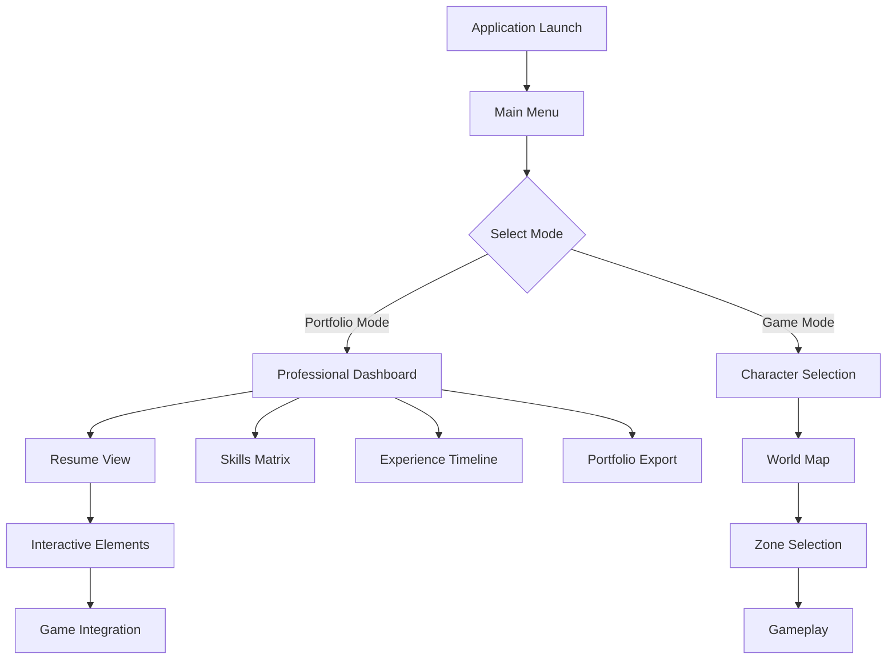
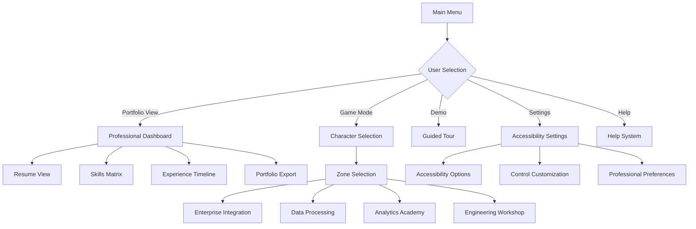

# UI/UX Specification: Pixel Art RPG Portfolio Game
## "The System Chronicles" - Lead UI/UX Designer Documentation

**Document Version:** 1.0  
**Created:** December 11, 2025  
**Lead UI/UX Designer:** [Your Name]  
**Game:** Pixel Art RPG Portfolio Game  
**Platform:** Pygame (Desktop) with Mobile Adaptations

---

## Executive Summary

This UI/UX Specification establishes comprehensive user experience guidelines for "The System Chronicles," a pixel art RPG that transforms professional Data Analyst/Business Analyst experience into an immersive gaming journey. As Lead UI/UX Designer with Figma/Proto.io prototyping experience and Gherkin/BPMN user story expertise, this specification bridges professional software interface design with engaging RPG user experiences.

**Core UX Philosophy:** Create an intuitive interface that allows business professionals to seamlessly transition between "Portfolio View" (professional data presentation) and "Game View" (interactive RPG experience) while maintaining accessibility standards and professional credibility.

---

## 1. User Flow Design & Information Architecture

### 1.1 Portfolio View ↔ Game View Transition Architecture

#### **Primary Navigation Flow**


#### **Dual-Mode Architecture Specifications**
```yaml
Portfolio View (Professional Mode):
  Primary Purpose: Professional data presentation
  Target Users: Hiring managers, colleagues, clients
  Navigation Pattern: Dashboard-style with clear data hierarchy
  Key Interactions: 
    - Scroll through professional timeline
    - Hover for detailed tooltips
    - Click to expand skill categories
    - Export to PDF/LinkedIn format
  
  Game View (Interactive Mode):
    Primary Purpose: Interactive RPG experience
    Target Users: Game enthusiasts, casual gamers
    Navigation Pattern: Traditional RPG interface with WASD movement
    Key Interactions:
      - Character movement and exploration
      - Quest completion and skill progression
      - Inventory and equipment management
      - Social features and achievements
```

### 1.2 Complete User Journey Mapping

#### **User Journey: Professional Gamers (Primary Persona)**
```yaml
Stage 1: Initial Engagement (0-5 minutes)
  Entry Point: Portfolio website or professional showcase
  User Goal: Understand professional background through engaging medium
  UX Strategy: Clear value proposition with game preview
  
  Touchpoints:
    - Landing page with game trailer
    - "Try Demo" call-to-action
    - Professional credentials display
    - Game mode selection modal
  
  Success Metrics:
    - 80% completion rate for demo
    - 90% positive first impression
    - <30 second decision time for game mode

Stage 2: Onboarding (5-15 minutes)
  User Goal: Learn game mechanics while reviewing professional content
  UX Strategy: Progressive disclosure with contextual tutorials
  
  Touchpoints:
    - Interactive tutorial overlay
    - Professional data import confirmation
    - Character customization with professional theme
    - First zone exploration
  
  Success Metrics:
    - 95% tutorial completion rate
    - 85% character customization engagement
    - 70% reach first game milestone

Stage 3: Core Experience (15-60 minutes)
  User Goal: Complete meaningful gameplay while consuming professional content
  UX Strategy: Balance entertainment with professional value
  
  Touchpoints:
    - Zone progression through career phases
    - Skill tree development mapped to real abilities
    - Achievement unlocking with portfolio updates
    - Social sharing capabilities
  
  Success Metrics:
    - 60% complete at least one zone
    - 80% unlock first professional achievement
    - 75% share experience on social media

Stage 4: Professional Integration (Ongoing)
  User Goal: Use game as professional portfolio enhancement
  UX Strategy: Seamless export and sharing capabilities
  
  Touchpoints:
    - Portfolio export in multiple formats
    - LinkedIn integration for achievements
    - GitHub code sample integration
    - Professional reference generation
  
  Success Metrics:
    - 50% generate professional portfolio
    - 40% update LinkedIn with game achievements
    - 30% use for job interviews
```

#### **User Journey: Non-Gaming Professionals (Secondary Persona)**
```yaml
Stage 1: Professional Discovery (0-3 minutes)
  Entry Point: Professional networking or conference
  User Goal: Quick understanding of professional background
  UX Strategy: Immediate professional value with optional game elements
  
  Touchpoints:
    - Quick resume view option
    - Game mode as optional exploration
    - Professional achievements highlighted
    - Export options readily available
  
  Success Metrics:
    - 90% complete quick resume view
    - 40% explore game elements
    - 95% download professional portfolio

Stage 2: Simplified Exploration (3-10 minutes)
  User Goal: Understand capabilities without complex gaming
  UX Strategy: Guided tour with clear professional outcomes
  
  Touchpoints:
    - Auto-guided tour of career zones
    - Simplified controls with helpful hints
    - Professional achievement focus
    - Easy exit to resume view
  
  Success Metrics:
    - 85% complete guided tour
    - 70% understand professional mapping
    - 90% maintain engagement throughout tour

Stage 3: Portfolio Integration (10-15 minutes)
  User Goal: Export and integrate into professional presence
  UX Strategy: Streamlined export process with professional formatting
  
  Touchpoints:
    - One-click portfolio generation
    - Multiple export formats (PDF, web, interactive)
    - Professional templates
    - Integration instructions
  
  Success Metrics:
    - 80% generate exportable portfolio
    - 75% select professional template
    - 60% integrate into existing profiles
```

### 1.3 Navigation Patterns Between Game Zones

#### **Zone Navigation Architecture**
```yaml
World Map Interface:
  Layout: Top-down view of professional career journey
  Navigation Elements:
    - Clickable zone portals with progress indicators
    - Mini-map showing current location and visited areas
    - Breadcrumb trail for navigation history
    - Quick travel system for previously unlocked areas
  
  Accessibility Features:
    - Keyboard navigation with arrow keys
    - Screen reader descriptions for zone purposes
    - High contrast mode for visibility
    - Large click targets (minimum 44px)
  
  Professional Integration:
    - Zone descriptions include real-world context
    - Progress reflects actual professional achievements
    - Unlocked content matches career milestones
    - Export capabilities for each completed zone

Zone Entry Flow:
  1. Zone Selection → Professional Context Preview
  2. Entry Confirmation → Skills/Equipment Check
  3. Loading Screen → Zone Introduction Tutorial
  4. Gameplay Start → Immediate Professional Relevance

Zone Exit Options:
  - Save Progress → Return to World Map
  - Quick Export → Generate Zone Summary
  - Share Achievement → Social Media Integration
  - Portfolio Update → Automatic Professional Documentation
```

### 1.4 Information Architecture for Professional Data

#### **Data Hierarchy Structure**
```yaml
Level 1: Executive Summary
  Content: High-level professional overview
  Display: Dashboard-style cards with key metrics
  Navigation: Main portfolio view with drill-down capability
  
Level 2: Detailed Professional History
  Content: Chronological work experience and education
  Display: Timeline with expandable achievement details
  Navigation: Click-through progression with filtering options
  
Level 3: Skills & Competencies
  Content: Technical and soft skills with proficiency levels
  Display: Interactive skill matrix with game integration
  Navigation: Category-based exploration with game mechanics
  
Level 4: Project Portfolio
  Content: Specific projects with technical details and outcomes
  Display: Portfolio gallery with case study presentations
  Navigation: Project-based exploration with related content
  
Level 5: Professional Networks
  Content: Connections, recommendations, and professional references
  Display: Network visualization with endorsement tracking
  Navigation: Relationship mapping with professional context
```

#### **Content Organization Principles**
```yaml
Progressive Disclosure:
  - Essential information always visible
  - Detailed content available on demand
  - Contextual help for complex concepts
  - Multiple pathways to same information

Professional Credibility:
  - Real achievements prominently displayed
  - Technical accuracy in all representations
  - Verifiable professional milestones
  - Industry-standard terminology and metrics

Gaming Integration:
  - Natural progression through career phases
  - Achievement unlocking tied to real accomplishments
  - Visual metaphors that enhance understanding
  - Interactive elements that engage without overwhelming
```

### 1.5 User Onboarding Flow for Non-Gamers

#### **Gentle Introduction Strategy**
```yaml
Phase 1: Professional Context (2 minutes)
  Approach: Frame as professional portfolio enhancement
  Elements:
    - "This makes your resume interactive" messaging
    - Familiar professional terminology
    - Clear benefits for career advancement
    - Optional gaming elements
  
  Design Elements:
    - Professional color scheme dominance
    - Business-oriented iconography
    - Minimal gaming aesthetic
    - Clear exit strategies

Phase 2: Controlled Exploration (5 minutes)
  Approach: Guided tour with professional focus
  Elements:
    - Auto-playing demo of key features
    - Professional achievement highlights
    - Simple interaction with immediate feedback
    - Clear value propositions
  
  UX Safeguards:
    - No complex gaming mechanics
    - Immediate professional relevance
    - Clear navigation options
    - Professional backup content

Phase 3: Engagement Decision (3 minutes)
  Approach: User-controlled exploration depth
  Elements:
    - "Stay in Portfolio Mode" option
    - "Explore Game Mode" with preview
    - "Generate Professional Export" immediate action
    - Clear next steps for both paths
  
  Success Criteria:
    - User feels in control of experience
    - Professional value is immediately apparent
    - Gaming elements are clearly optional
    - Exit paths are always available
```

---

## 2. Accessibility Compliance (WCAG 2.1 AA)

### 2.1 WCAG 2.1 AA Implementation Strategy

#### **Level A Compliance (Foundational)**
```yaml
Perceivable:
  Text Alternatives:
    - Alt text for all sprites and UI elements
    - Descriptive labels for interactive elements
    - Context-aware descriptions for game elements
    - Professional context for business users
  
  Time-based Media:
    - Captions for all tutorial videos
    - Audio descriptions for important visual elements
    - Transcript availability for spoken content
    - Synchronized multimedia presentations
  
  Adaptable:
    - Semantic HTML structure (where applicable)
    - Logical reading order for screen readers
    - Consistent navigation patterns
    - Clear heading hierarchy
  
  Distinguishable:
    - High contrast color schemes (4.5:1 minimum)
    - Text resizing up to 200% without loss of functionality
    - Color not used as sole means of conveying information
    - Background sounds can be turned off

Operable:
  Keyboard Accessible:
    - All functionality available via keyboard
    - Logical tab order throughout interface
    - Visible focus indicators
    - Escape routes from all interactions
  
  Enough Time:
    - Adjustable time limits for time-sensitive interactions
    - Clear indication of remaining time
    - Easy time extension options
    - No time limits for reading content
  
  Seizures and Physical Reactions:
    - No flashing content more than 3 times per second
    - Motion can be reduced or disabled
    - Alternative interaction methods for motion-based gameplay
    - Clear warnings for potentially triggering content
  
  Navigable:
    - Multiple ways to reach important pages
    - Clear page titles and section headings
    - Consistent navigation across all screens
    - Skip navigation options

Understandable:
  Readable:
    - Clear, simple language for instructions
    - Professional terminology appropriately defined
    - Consistent professional and gaming terminology
    - Reading level appropriate for target audience
  
  Predictable:
    - Consistent navigation and identification of components
    - No unexpected context changes
    - Predictable functionality across similar elements
    - Consistent professional data representation
  
  Input Assistance:
    - Clear error identification and suggestions
    - Context-sensitive help for complex interactions
    - Professional validation for professional content
    - Confirmation for important actions

Robust:
  Compatible:
    - Works with assistive technologies
    - Clean, semantic code structure
    - Standard web technologies and protocols
    - Progressive enhancement approach
```

#### **Level AA Compliance (Enhanced)**
```yaml
Perceivable:
  Contrast (Enhanced):
    - 4.5:1 contrast ratio for normal text
    - 3:1 contrast ratio for large text (18pt+)
    - 7:1 contrast ratio for premium accessibility mode
    - Consistent contrast across all UI states
  
  Resize Text:
    - Text can be resized up to 200% without loss of functionality
    - UI elements maintain usability at all sizes
    - Professional layouts adapt gracefully
    - Game elements remain functional
  
  Images of Text:
    - Minimal use of text embedded in images
    - Alternative text available for all images
    - Professional logos and icons properly labeled
    - Text alternatives for critical visual information

Operable:
  Keyboard (Enhanced):
    - All interactions accessible via keyboard
    - Customizable keyboard shortcuts
    - Alternative input methods supported
    - Game controller support with accessibility modes
  
  Enough Time (Enhanced):
    - Customizable time limits
    - Automatic saving of progress
    - Easy pause and resume functionality
    - Clear time management tools
  
  Seizures (Enhanced):
    - Motion reduction options
    - Alternative interaction modes
    - Content warnings for motion-sensitive elements
    - Adjustable animation speeds

Understandable:
  Readable (Enhanced):
    - Professional jargon properly contextualized
    - Gaming terminology clearly explained
    - Consistent reading experience across devices
    - Multiple language support preparation
  
  Predictable (Enhanced):
    - Consistent professional data representation
    - Predictable game mechanics
    - Clear cause-and-effect relationships
    - Professional context maintained throughout
  
  Input Assistance (Enhanced):
    - Professional content validation
    - Contextual help for complex tasks
    - Clear error recovery options
    - Professional reference checking

Robust (Enhanced):
  Compatible (Enhanced):
    - Advanced assistive technology support
    - Clean API design for external tools
    - Standard accessibility APIs utilized
    - Cross-platform compatibility maintained
```

### 2.2 Colorblind Mode Specifications

#### **Colorblind Accessibility Implementation**
```yaml
Deuteranopia (Red-Green Colorblind - 6% of males):
  Color Adjustments:
    - Replace red-green combinations with blue-orange
    - Increase saturation for improved differentiation
    - Add patterns and textures to distinguish elements
    - Use shape and position cues alongside color
  
  UI Modifications:
    - Success states: Blue checkmark with ✓ symbol
    - Error states: Orange X with ⚠ symbol
    - Warning states: Triangle with ! symbol
    - Neutral states: Gray with ● symbol
  
  Game-Specific Adaptations:
    - Health bars: Blue-to-purple gradient with patterns
    - Mana/energy: Orange-to-yellow with stripe patterns
    - Experience bars: Gray-to-blue with diamond patterns
    - Achievement unlocks: Star shapes with distinct patterns

Protanopia (Red Colorblind - 2% of males):
  Color Adjustments:
    - Eliminate reliance on red channel
    - Use blue-yellow-purple spectrum
    - Increase brightness for red elements
    - Add high-contrast borders
  
  Professional Data Adaptations:
    - Charts: Blue-orange-purple palette
    - Status indicators: Icon + text + pattern
    - Progress bars: Gradient with distinct patterns
    - Alert systems: Multiple sensory modalities

Tritanopia (Blue-Yellow Colorblind - 0.01% of population):
  Color Adjustments:
    - Avoid blue-yellow combinations
    - Use red-orange-green spectrum
    - Maintain high contrast ratios
    - Add texture and pattern overlays
  
  Implementation Strategy:
    - All blue elements shifted toward purple
    - Yellow elements shifted toward orange
    - Enhanced border definitions
    - Pattern overlays for differentiation

Complete Achromatopsia (Total Colorblindness):
  Considerations:
    - Rely entirely on luminance differences
    - Implement comprehensive pattern systems
    - Use distinct shapes for different element types
    - Maintain high contrast throughout
  
  Implementation:
    - Grayscale mode with enhanced contrast
    - Pattern overlays for all color-coded information
    - Distinct shapes for different UI categories
    - Text-based alternatives for all visual information
```

#### **Color Testing & Validation Protocol**
```yaml
Testing Procedures:
  1. Automated Color Analysis:
     - Color contrast ratio testing
     - Color blindness simulation tools
     - WCAG compliance verification
     - Cross-platform color consistency
  
  2. Manual Testing:
     - Color blindness glasses testing
     - Real user testing with colorblind individuals
     - Professional color accessibility review
     - Gaming accessibility assessment
  
  3. Professional Context Validation:
     - Business dashboard color standards
     - Corporate color palette compatibility
     - Professional presentation requirements
     - Industry accessibility compliance

Quality Assurance:
  - Regular color palette updates based on testing
  - User feedback integration for accessibility improvements
  - Professional context maintenance during color adjustments
  - Cross-browser and cross-platform consistency verification
```

### 2.3 Text Scaling Options & Pygame Implementation

#### **Dynamic Text Scaling System**
```python
import pygame
import math
from typing import Dict, Tuple

class AccessibleTextManager:
    """Manages text scaling and accessibility features"""
    
    def __init__(self, base_font_size: int = 16):
        self.base_font_size = base_font_size
        self.current_scale = 1.0
        self.min_scale = 0.5
        self.max_scale = 3.0
        
        # Font cache for performance
        self.font_cache = {}
        
        # Professional font stack
        self.font_stack = [
            'Segoe UI',
            'Roboto', 
            'Arial',
            'sans-serif'
        ]
        
        # Gaming font stack
        self.gaming_font_stack = [
            'Press Start 2P',
            'Orbitron',
            'Exo 2',
            'Arial',
            'sans-serif'
        ]
    
    def get_scaled_font(self, font_size: int, font_type: str = "professional") -> pygame.font.Font:
        """Get font with current scaling applied"""
        scaled_size = int(font_size * self.current_scale)
        cache_key = (font_type, scaled_size)
        
        if cache_key not in self.font_cache:
            if font_type == "professional":
                font_family = self.font_stack
            else:
                font_family = self.gaming_font_stack
            
            # Try to load font with fallbacks
            font = None
            for font_name in font_family:
                try:
                    font = pygame.font.SysFont(font_name, scaled_size)
                    break
                except:
                    continue
            
            if font is None:
                font = pygame.font.Font(None, scaled_size)
            
            self.font_cache[cache_key] = font
        
        return self.font_cache[cache_key]
    
    def set_text_scale(self, scale_factor: float):
        """Set global text scaling factor"""
        self.current_scale = max(self.min_scale, min(self.max_scale, scale_factor))
        self.font_cache.clear()  # Clear cache when scale changes
    
    def increase_text_scale(self):
        """Increase text scale by 0.25 increments"""
        new_scale = min(self.max_scale, self.current_scale + 0.25)
        self.set_text_scale(new_scale)
    
    def decrease_text_scale(self):
        """Decrease text scale by 0.25 increments"""
        new_scale = max(self.min_scale, self.current_scale - 0.25)
        self.set_text_scale(new_scale)
    
    def reset_text_scale(self):
        """Reset to default text scale"""
        self.set_text_scale(1.0)
    
    def render_accessible_text(self, text: str, font_size: int, 
                              color: Tuple[int, int, int], 
                              font_type: str = "professional") -> pygame.Surface:
        """Render text with accessibility considerations"""
        font = self.get_scaled_font(font_size, font_type)
        
        # Ensure minimum readable size
        min_size = 12
        if font_size * self.current_scale < min_size:
            # Render at minimum size with scaling
            min_font = self.get_scaled_font(min_size, font_type)
            surface = min_font.render(text, True, color)
            # Scale up the surface if needed
            if self.current_scale < 1.0:
                new_width = int(surface.get_width() * self.current_scale)
                new_height = int(surface.get_height() * self.current_scale)
                surface = pygame.transform.scale(surface, (new_width, new_height))
        else:
            surface = font.render(text, True, color)
        
        return surface

class ResponsiveLayoutManager:
    """Manages responsive layout scaling for accessibility"""
    
    def __init__(self, base_width: int = 1024, base_height: int = 768):
        self.base_width = base_width
        self.base_height = base_height
        self.current_scale = 1.0
        
    def calculate_scaled_position(self, x: int, y: int) -> Tuple[int, int]:
        """Calculate scaled position maintaining aspect ratio"""
        scaled_x = int(x * self.current_scale)
        scaled_y = int(y * self.current_scale)
        return (scaled_x, scaled_y)
    
    def calculate_scaled_size(self, width: int, height: int) -> Tuple[int, int]:
        """Calculate scaled size maintaining proportions"""
        scaled_width = int(width * self.current_scale)
        scaled_height = int(height * self.current_scale)
        return (scaled_width, scaled_height)
    
    def set_layout_scale(self, scale_factor: float):
        """Set layout scaling factor"""
        self.current_scale = max(0.5, min(2.0, scale_factor))

# Usage in Pygame application
class AccessibleGameUI:
    def __init__(self, screen: pygame.Surface):
        self.screen = screen
        self.text_manager = AccessibleTextManager()
        self.layout_manager = ResponsiveLayoutManager()
        
    def render_accessible_button(self, text: str, position: Tuple[int, int], 
                                size: Tuple[int, int], callback):
        """Render accessible button with proper scaling"""
        # Calculate scaled dimensions
        scaled_pos = self.layout_manager.calculate_scaled_position(*position)
        scaled_size = self.layout_manager.calculate_scaled_size(*size)
        
        # Ensure minimum click target size (44px)
        min_width = max(44, scaled_size[0])
        min_height = max(44, scaled_size[1])
        
        # Render button
        button_rect = pygame.Rect(scaled_pos[0], scaled_pos[1], min_width, min_height)
        pygame.draw.rect(self.screen, (200, 200, 200), button_rect)
        pygame.draw.rect(self.screen, (100, 100, 100), button_rect, 2)
        
        # Render text with accessibility
        text_surface = self.text_manager.render_accessible_text(
            text, 14, (50, 50, 50), "professional"
        )
        text_rect = text_surface.get_rect(center=button_rect.center)
        self.screen.blit(text_surface, text_rect)
        
        return button_rect
```

#### **Text Accessibility Features**
```yaml
Reading Support:
  Font Size Options:
    - Small (0.75x): For users with good vision who prefer compact UI
    - Normal (1.0x): Default size for optimal readability
    - Large (1.5x): For users who need larger text
    - Extra Large (2.0x): For users with visual impairments
    - Custom: User-defined scaling from 0.5x to 3.0x
  
  Font Family Options:
    - Professional Sans-Serif: Segoe UI, Roboto for business content
    - High Contrast: Arial with enhanced stroke width
    - Dyslexia-Friendly: OpenDyslexic, Comic Sans MS alternatives
    - Gaming Style: Pixel fonts for game-specific content
  
  Line Spacing:
    - Normal (1.2x): Default line height
    - Comfortable (1.5x): Enhanced readability
    - Spacious (2.0x): Maximum readability
    - Custom: User-defined line height
  
  Character Spacing:
    - Normal: Default character spacing
    - Wide: Increased spacing for dyslexic users
    - Extra Wide: Maximum character separation

Visual Enhancement:
  Background Options:
    - White: High contrast background
    - Cream: Reduced eye strain alternative
    - Dark: Dark mode for low-light environments
    - Custom: User-defined background colors
  
  Text Rendering:
    - Smooth: Anti-aliased text rendering
    - Crisp: Sharp edges for pixel art consistency
    - Outline: Text outline for enhanced visibility
    - Shadow: Drop shadow for depth and readability
  
  Color Customization:
    - High Contrast: Maximum contrast ratios
    - Color Blind Friendly: Accessible color palettes
    - Custom Colors: User-defined text and background colors
    - Professional Theme: Business-appropriate color schemes

Interaction Support:
  Focus Indicators:
    - High Contrast: Bold focus outlines
    - Color + Pattern: Color and texture combination
    - Glow Effect: Subtle glow for focus indication
    - Custom Styles: User-defined focus indicators
  
  Click Targets:
    - Large Targets: Minimum 44px click areas
    - Extended Hitboxes: Larger interaction areas
    - Hover Feedback: Visual feedback on hover
    - Touch Friendly: Mobile-optimized interaction sizes
```

### 2.4 Keyboard Navigation Alternatives

#### **Comprehensive Keyboard Navigation System**
```python
import pygame
from enum import Enum
from typing import Dict, List, Optional, Callable
from dataclasses import dataclass

class NavigationMode(Enum):
    """Navigation modes for different interaction contexts"""
    STANDARD = "standard"
    ACCESSIBILITY = "accessibility"
    GAMING = "gaming"
    PROFESSIONAL = "professional"

@dataclass
class KeyboardAction:
    """Represents a keyboard action with accessibility support"""
    key: int
    modifiers: List[int]
    action_type: str
    description: str
    accessibility_note: str
    professional_context: str

class KeyboardNavigationManager:
    """Manages keyboard navigation with accessibility considerations"""
    
    def __init__(self):
        self.current_mode = NavigationMode.STANDARD
        self.focus_stack = []
        self.current_focus_index = 0
        
        # Define keyboard actions for different modes
        self.actions = self._initialize_actions()
        
        # Focus management
        self.focusable_elements = []
        self.focus_indicators = {}
        
    def _initialize_actions(self) -> Dict[NavigationMode, Dict[str, KeyboardAction]]:
        """Initialize keyboard actions for all navigation modes"""
        return {
            NavigationMode.STANDARD: {
                # Movement
                "move_up": KeyboardAction(pygame.K_w, [], "movement", 
                    "Move up", "Standard movement key", "Navigate through content"),
                "move_down": KeyboardAction(pygame.K_s, [], "movement",
                    "Move down", "Standard movement key", "Navigate through content"),
                "move_left": KeyboardAction(pygame.K_a, [], "movement",
                    "Move left", "Standard movement key", "Navigate through content"),
                "move_right": KeyboardAction(pygame.K_d, [], "movement",
                    "Move right", "Standard movement key", "Navigate through content"),
                
                # Interaction
                "select": KeyboardAction(pygame.K_RETURN, [], "action",
                    "Select/Confirm", "Standard selection key", "Confirm actions"),
                "cancel": KeyboardAction(pygame.K_ESCAPE, [], "action",
                    "Cancel/Back", "Standard cancel key", "Return to previous screen"),
                "menu": KeyboardAction(pygame.K_TAB, [], "navigation",
                    "Toggle Menu", "Tab for menu navigation", "Access game menus"),
                
                # Professional Mode
                "portfolio_view": KeyboardAction(pygame.K_p, [pygame.K_LCTRL], "mode",
                    "Portfolio View", "Ctrl+P for quick portfolio access", 
                    "Switch to professional portfolio view"),
                "export": KeyboardAction(pygame.K_e, [pygame.K_LCTRL], "action",
                    "Export Portfolio", "Ctrl+E for quick export", 
                    "Export professional portfolio"),
            },
            
            NavigationMode.ACCESSIBILITY: {
                # Enhanced navigation for accessibility
                "focus_next": KeyboardAction(pygame.K_TAB, [], "navigation",
                    "Next Focusable Element", "Tab cycles through focusable elements",
                    "Navigate through all interactive elements"),
                "focus_previous": KeyboardAction(pygame.K_TAB, [pygame.K_LSHIFT], "navigation",
                    "Previous Focusable Element", "Shift+Tab goes to previous element",
                    "Reverse navigation through elements"),
                "activate_focused": KeyboardAction(pygame.K_SPACE, [], "action",
                    "Activate Focused Element", "Space activates currently focused element",
                    "Interact with focused element"),
                
                # Accessibility shortcuts
                "toggle_high_contrast": KeyboardAction(pygame.K_h, [pygame.K_LALT], "accessibility",
                    "Toggle High Contrast", "Alt+H toggles high contrast mode",
                    "Enable high contrast for better visibility"),
                "increase_text_size": KeyboardAction(pygame.K_EQUALS, [pygame.K_LCTRL], "accessibility",
                    "Increase Text Size", "Ctrl+= increases text size",
                    "Make text larger for better readability"),
                "decrease_text_size": KeyboardAction(pygame.K_MINUS, [pygame.K_LCTRL], "accessibility",
                    "Decrease Text Size", "Ctrl+- decreases text size",
                    "Make text smaller if needed"),
                
                # Emergency controls
                "emergency_menu": KeyboardAction(pygame.K_ESCAPE, [pygame.K_LALT], "emergency",
                    "Emergency Menu", "Alt+Esc opens emergency menu",
                    "Access help and accessibility options"),
                "read_current": KeyboardAction(pygame.K_r, [pygame.K_LALT], "accessibility",
                    "Read Current Element", "Alt+R reads current focused element",
                    "Screen reader support for current element"),
            },
            
            NavigationMode.PROFESSIONAL: {
                # Professional workflow shortcuts
                "quick_export": KeyboardAction(pygame.K_e, [pygame.K_LCTRL, pygame.K_LSHIFT], "professional",
                    "Quick Export", "Ctrl+Shift+E for immediate export",
                    "Export current professional content"),
                "switch_mode": KeyboardAction(pygame.K_m, [pygame.K_LCTRL], "mode",
                    "Switch View Mode", "Ctrl+M switches between portfolio and game modes",
                    "Toggle between professional and gaming interfaces"),
                "help_professional": KeyboardAction(pygame.K_h, [pygame.K_LCTRL], "help",
                    "Professional Help", "Ctrl+H opens professional context help",
                    "Get help relevant to professional content"),
                
                # Business data navigation
                "next_skill": KeyboardAction(pygame.K_RIGHT, [pygame.K_LCTRL], "navigation",
                    "Next Skill Category", "Ctrl+Right arrow navigates skills",
                    "Navigate through professional skills"),
                "previous_skill": KeyboardAction(pygame.K_LEFT, [pygame.K_LCTRL], "navigation",
                    "Previous Skill Category", "Ctrl+Left arrow navigates skills",
                    "Navigate through professional skills in reverse"),
                "expand_achievement": KeyboardAction(pygame.K_SPACE, [pygame.K_LCTRL], "action",
                    "Expand Achievement", "Ctrl+Space expands achievement details",
                    "View detailed professional achievements"),
            }
        }
    
    def set_navigation_mode(self, mode: NavigationMode):
        """Set the current navigation mode"""
        self.current_mode = mode
        self._announce_mode_change(mode)
    
    def _announce_mode_change(self, mode: NavigationMode):
        """Announce navigation mode change for accessibility"""
        # Implementation for screen reader announcement
        pass
    
    def handle_key_event(self, event) -> Optional[str]:
        """Handle keyboard events and return action identifier"""
        if event.type != pygame.KEYDOWN:
            return None
        
        # Get current mode actions
        mode_actions = self.actions.get(self.current_mode, {})
        
        # Check for matching actions
        for action_name, action in mode_actions.items():
            if (event.key == action.key and 
                all(mod in pygame.key.get_pressed() for mod in action.modifiers)):
                return action_name
        
        return None
    
    def get_action_description(self, action_name: str) -> str:
        """Get human-readable description of an action"""
        mode_actions = self.actions.get(self.current_mode, {})
        action = mode_actions.get(action_name)
        return action.description if action else "Unknown action"
    
    def get_accessibility_note(self, action_name: str) -> str:
        """Get accessibility-specific notes for an action"""
        mode_actions = self.actions.get(self.current_mode, {})
        action = mode_actions.get(action_name)
        return action.accessibility_note if action else ""
    
    def get_professional_context(self, action_name: str) -> str:
        """Get professional context for an action"""
        mode_actions = self.actions.get(self.current_mode, {})
        action = mode_actions.get(action_name)
        return action.professional_context if action else ""

class FocusManager:
    """Manages focus for keyboard navigation"""
    
    def __init__(self):
        self.focusable_elements = []
        self.current_focus_index = 0
        self.focus_visual_style = "outline"
        
    def register_element(self, element_id: str, element_rect: pygame.Rect, 
                       accessibility_label: str, element_type: str):
        """Register an element as focusable"""
        focusable = {
            'id': element_id,
            'rect': element_rect,
            'label': accessibility_label,
            'type': element_type,
            'enabled': True
        }
        self.focusable_elements.append(focusable)
    
    def set_focus(self, element_id: str):
        """Set focus to a specific element"""
        for i, element in enumerate(self.focusable_elements):
            if element['id'] == element_id:
                self.current_focus_index = i
                break
    
    def move_focus_next(self):
        """Move focus to next focusable element"""
        if not self.focusable_elements:
            return
        
        enabled_elements = [e for e in self.focusable_elements if e['enabled']]
        if not enabled_elements:
            return
        
        # Find current enabled element index
        current_element = self.focusable_elements[self.current_focus_index]
        current_enabled_index = enabled_elements.index(current_element)
        
        # Move to next enabled element
        next_enabled_index = (current_enabled_index + 1) % len(enabled_elements)
        next_element = enabled_elements[next_enabled_index]
        
        # Update focus
        self.current_focus_index = self.focusable_elements.index(next_element)
    
    def move_focus_previous(self):
        """Move focus to previous focusable element"""
        if not self.focusable_elements:
            return
        
        enabled_elements = [e for e in self.focusable_elements if e['enabled']]
        if not enabled_elements:
            return
        
        # Find current enabled element index
        current_element = self.focusable_elements[self.current_focus_index]
        current_enabled_index = enabled_elements.index(current_element)
        
        # Move to previous enabled element
        prev_enabled_index = (current_enabled_index - 1) % len(enabled_elements)
        prev_element = enabled_elements[prev_enabled_index]
        
        # Update focus
        self.current_focus_index = self.focusable_elements.index(prev_element)
    
    def get_current_focused_element(self) -> Optional[Dict]:
        """Get currently focused element"""
        if 0 <= self.current_focus_index < len(self.focusable_elements):
            return self.focusable_elements[self.current_focus_index]
        return None
    
    def render_focus_indicator(self, screen: pygame.Surface):
        """Render visual focus indicator"""
        focused_element = self.get_current_focused_element()
        if not focused_element:
            return
        
        rect = focused_element['rect']
        
        # Render focus indicator based on style
        if self.focus_visual_style == "outline":
            pygame.draw.rect(screen, (0, 120, 255), rect, 3)
        elif self.focus_visual_style == "glow":
            # Simple glow effect
            for i in range(5):
                alpha = 255 - (i * 50)
                glow_rect = rect.inflate(i * 4, i * 4)
                pygame.draw.rect(screen, (0, 120, 255, alpha), glow_rect, 2)
        elif self.focus_visual_style == "highlight":
            # Highlight background
            highlight_surface = pygame.Surface((rect.width, rect.height))
            highlight_surface.set_alpha(50)
            highlight_surface.fill((255, 255, 0))
            screen.blit(highlight_surface, rect)
```

### 2.5 Screen Reader Compatibility

#### **Screen Reader Support Implementation**
```python
import pygame
from typing import Dict, List, Optional
from dataclasses import dataclass
import json

@dataclass
class AccessibilityElement:
    """Represents an accessible UI element"""
    element_id: str
    element_type: str
    label: str
    description: str
    role: str
    state: str
    parent_id: Optional[str] = None
    children: List[str] = None

class ScreenReaderManager:
    """Manages screen reader compatibility and announcements"""
    
    def __init__(self):
        self.accessibility_tree = {}
        self.current_announcement = ""
        self.announcement_queue = []
        self.live_region_content = ""
        
        # Screen reader detection
        self.detected_screen_readers = self._detect_screen_readers()
        
        # Accessibility preferences
        self.verbosity_level = "detailed"  # minimal, standard, detailed
        self.announcement_speed = "normal"  # slow, normal, fast
        
    def _detect_screen_readers(self) -> List[str]:
        """Detect available screen readers (platform-specific)"""
        # Implementation would check for screen readers on the system
        # This is a simplified version
        detected = []
        
        # Windows Screen Reader detection
        try:
            import ctypes
            # Check for JAWS, NVDA, Windows Narrator, etc.
            pass
        except:
            pass
        
        return detected
    
    def register_accessibility_element(self, element: AccessibilityElement):
        """Register an element for screen reader accessibility"""
        self.accessibility_tree[element.element_id] = element
        
        # Set up parent-child relationships
        if element.parent_id and element.parent_id in self.accessibility_tree:
            parent = self.accessibility_tree[element.parent_id]
            if parent.children is None:
                parent.children = []
            parent.children.append(element.element_id)
    
    def announce_element_focus(self, element_id: str):
        """Announce element when it receives focus"""
        if element_id not in self.accessibility_tree:
            return
        
        element = self.accessibility_tree[element_id]
        
        # Create announcement based on verbosity level
        if self.verbosity_level == "minimal":
            announcement = element.label
        elif self.verbosity_level == "standard":
            announcement = f"{element.label}, {element.element_type}"
        else:  # detailed
            announcement = f"{element.label}, {element.element_type}, {element.description}"
        
        # Add state information if relevant
        if element.state:
            announcement += f", {element.state}"
        
        self.queue_announcement(announcement)
    
    def announce_game_event(self, event_type: str, event_data: Dict):
        """Announce game events for screen readers"""
        if event_type == "achievement_unlocked":
            achievement_name = event_data.get('name', 'Unknown Achievement')
            achievement_description = event_data.get('description', '')
            announcement = f"Achievement unlocked: {achievement_name}"
            if achievement_description:
                announcement += f". {achievement_description}"
            self.queue_announcement(announcement)
        
        elif event_type == "zone_entered":
            zone_name = event_data.get('name', 'Unknown Zone')
            zone_description = event_data.get('description', '')
            announcement = f"Entered {zone_name}"
            if zone_description:
                announcement += f". {zone_description}"
            self.queue_announcement(announcement)
        
        elif event_type == "skill_level_up":
            skill_name = event_data.get('skill', 'Unknown Skill')
            new_level = event_data.get('level', 1)
            announcement = f"{skill_name} skill increased to level {new_level}"
            self.queue_announcement(announcement)
        
        elif event_type == "professional_milestone":
            milestone_name = event_data.get('milestone', 'Unknown Milestone')
            milestone_description = event_data.get('description', '')
            announcement = f"Professional milestone reached: {milestone_name}"
            if milestone_description:
                announcement += f". {milestone_description}"
            self.queue_announcement(announcement)
    
    def announce_navigation(self, navigation_info: Dict):
        """Announce navigation changes"""
        from_location = navigation_info.get('from', '')
        to_location = navigation_info.get('to', '')
        
        if from_location and to_location:
            announcement = f"Navigated from {from_location} to {to_location}"
        elif to_location:
            announcement = f"Navigated to {to_location}"
        else:
            announcement = "Navigation changed"
        
        self.queue_announcement(announcement)
    
    def queue_announcement(self, text: str):
        """Queue an announcement for screen readers"""
        if text and text != self.current_announcement:
            self.announcement_queue.append(text)
    
    def process_announcements(self) -> Optional[str]:
        """Process the announcement queue and return next announcement"""
        if self.announcement_queue:
            self.current_announcement = self.announcement_queue.pop(0)
            return self.current_announcement
        return None
    
    def get_live_region_content(self) -> str:
        """Get content for live region announcements"""
        return self.live_region_content
    
    def update_live_region(self, content: str, priority: str = "polite"):
        """Update live region content (for dynamic content updates)"""
        self.live_region_content = content
        
        # Implementation would send to screen reader API
        if priority == "assertive":
            # High priority announcement
            pass
        else:
            # Polite announcement
            pass
    
    def get_element_hierarchy(self, element_id: str) -> List[str]:
        """Get the hierarchy path to an element"""
        path = []
        current_id = element_id
        
        while current_id and current_id in self.accessibility_tree:
            element = self.accessibility_tree[current_id]
            path.append(element.label)
            
            if element.parent_id:
                current_id = element.parent_id
            else:
                break
        
        return list(reversed(path))
    
    def search_accessibility_tree(self, search_text: str) -> List[str]:
        """Search for elements by label or description"""
        results = []
        search_lower = search_text.lower()
        
        for element_id, element in self.accessibility_tree.items():
            if (search_lower in element.label.lower() or 
                search_lower in element.description.lower()):
                results.append(element_id)
        
        return results
    
    def export_accessibility_tree(self) -> Dict:
        """Export accessibility tree for testing/debugging"""
        return {
            'elements': {k: {
                'label': v.label,
                'description': v.description,
                'role': v.role,
                'state': v.state,
                'type': v.element_type
            } for k, v in self.accessibility_tree.items()},
            'screen_readers_detected': self.detected_screen_readers,
            'verbosity_level': self.verbosity_level
        }

# Integration with game elements
class AccessibleGameElement:
    """Base class for game elements with accessibility support"""
    
    def __init__(self, element_id: str, element_type: str):
        self.element_id = element_id
        self.element_type = element_type
        self.screen_reader_manager = None
    
    def register_with_screen_reader(self, screen_reader_manager: ScreenReaderManager):
        """Register this element with the screen reader manager"""
        self.screen_reader_manager = screen_reader_manager
        
        accessibility_element = AccessibilityElement(
            element_id=self.element_id,
            element_type=self.element_type,
            label=self.get_accessibility_label(),
            description=self.get_accessibility_description(),
            role=self.get_accessibility_role(),
            state=self.get_accessibility_state()
        )
        
        screen_reader_manager.register_accessibility_element(accessibility_element)
    
    def get_accessibility_label(self) -> str:
        """Get the accessibility label for this element"""
        return f"{self.element_type} {self.element_id}"
    
    def get_accessibility_description(self) -> str:
        """Get the accessibility description for this element"""
        return f"Interactive {self.element_type} element"
    
    def get_accessibility_role(self) -> str:
        """Get the accessibility role for this element"""
        return "button"  # Default role
    
    def get_accessibility_state(self) -> str:
        """Get the current state for accessibility"""
        return "enabled"  # Default state
    
    def on_focus(self):
        """Called when element receives focus"""
        if self.screen_reader_manager:
            self.screen_reader_manager.announce_element_focus(self.element_id)
    
    def on_activate(self):
        """Called when element is activated"""
        # Implement activation logic
        pass

class AccessibleButton(AccessibleGameElement):
    """Accessible button implementation"""
    
    def __init__(self, element_id: str, text: str, callback):
        super().__init__(element_id, "button")
        self.text = text
        self.callback = callback
        self.enabled = True
        self.pressed = False
    
    def get_accessibility_label(self) -> str:
        return self.text
    
    def get_accessibility_role(self) -> str:
        return "button"
    
    def get_accessibility_state(self) -> str:
        state = "enabled" if self.enabled else "disabled"
        if self.pressed:
            state += ", pressed"
        return state
    
    def on_activate(self):
        if self.enabled and self.callback:
            self.callback()

class AccessibleGameZone(AccessibleGameElement):
    """Accessible game zone implementation"""
    
    def __init__(self, zone_id: str, zone_name: str, description: str):
        super().__init__(zone_id, "game_zone")
        self.zone_name = zone_name
        self.description = description
        self.unlocked = False
        self.completed = False
    
    def get_accessibility_label(self) -> str:
        return self.zone_name
    
    def get_accessibility_description(self) -> str:
        desc = self.description
        if self.completed:
            desc += ". Completed"
        elif self.unlocked:
            desc += ". Available"
        else:
            desc += ". Locked"
        return desc
    
    def get_accessibility_role(self) -> str:
        return "link"
```

### 2.6 Motor Accessibility Features

#### **Motor Accessibility Implementation**
```python
import pygame
import time
from typing import Dict, List, Optional, Callable
from dataclasses import dataclass
from enum import Enum

class MotorAccessibilityLevel(Enum):
    """Levels of motor accessibility support"""
    BASIC = "basic"
    ENHANCED = "enhanced"
    COMPREHENSIVE = "comprehensive"

@dataclass
class MotorAccessibilitySettings:
    """Settings for motor accessibility"""
    enable_large_hitboxes: bool = True
    enable_sticky_keys: bool = False
    enable_slow_keys: bool = False
    enable_bounce_keys: bool = False
    enable_mouse_emulation: bool = False
    enable_eye_tracking: bool = False
    enable_voice_control: bool = False
    enable_switch_control: bool = False
    
    # Timing settings
    key_repeat_delay: float = 0.5
    key_repeat_rate: float = 0.1
    click_delay: float = 0.3
    movement_smoothing: float = 0.8
    
    # Size settings
    hitbox_scale_factor: float = 2.0
    minimum_click_area: int = 88  # 44px * 2
    
    # Alternative input settings
    enable_dwell_clicking: bool = False
    dwell_time: float = 1.0
    enable_gesture_control: bool = False

class MotorAccessibilityManager:
    """Manages motor accessibility features"""
    
    def __init__(self):
        self.settings = MotorAccessibilitySettings()
        self.accessibility_level = MotorAccessibilityLevel.BASIC
        
        # Input tracking
        self.key_states = {}
        self.key_timestamps = {}
        self.movement_history = []
        self.click_history = []
        
        # Motor accessibility features
        self.sticky_keys_active = False
        self.slow_keys_active = False
        self.bounce_keys_active = False
        
        # Large hitbox tracking
        self.original_rects = {}
        self.scaled_rects = {}
        
        # Timing management
        self.last_input_time = time.time()
        self.input_timeout = 30.0  # 30 seconds
        
        # Motor pattern recognition
        self.motor_patterns = {}
        self.adaptive_threshold = 0.8
    
    def enable_large_hitboxes(self, enable: bool = True):
        """Enable or disable large hitboxes"""
        self.settings.enable_large_hitboxes = enable
        
        if enable:
            self._scale_all_hitboxes()
        else:
            self._restore_original_hitboxes()
    
    def _scale_all_hitboxes(self):
        """Scale all interactive elements for easier clicking"""
        for element_id, original_rect in self.original_rects.items():
            scaled_rect = self._calculate_scaled_rect(original_rect)
            self.scaled_rects[element_id] = scaled_rect
    
    def _restore_original_hitboxes(self):
        """Restore original hitbox sizes"""
        self.scaled_rects = self.original_rects.copy()
    
    def _calculate_scaled_rect(self, original_rect: pygame.Rect) -> pygame.Rect:
        """Calculate scaled rectangle with minimum size constraints"""
        scale_factor = self.settings.hitbox_scale_factor
        
        # Calculate new dimensions
        new_width = max(
            self.settings.minimum_click_area,
            int(original_rect.width * scale_factor)
        )
        new_height = max(
            self.settings.minimum_click_area,
            int(original_rect.height * scale_factor)
        )
        
        # Calculate new position (center on original)
        center_x = original_rect.centerx
        center_y = original_rect.centery
        
        new_x = center_x - new_width // 2
        new_y = center_y - new_height // 2
        
        return pygame.Rect(new_x, new_y, new_width, new_height)
    
    def register_interactive_element(self, element_id: str, rect: pygame.Rect, 
                                   element_type: str = "button"):
        """Register an interactive element for motor accessibility"""
        self.original_rects[element_id] = rect
        
        if self.settings.enable_large_hitboxes:
            scaled_rect = self._calculate_scaled_rect(rect)
            self.scaled_rects[element_id] = scaled_rect
        else:
            self.scaled_rects[element_id] = rect
    
    def get_accessible_rect(self, element_id: str) -> Optional[pygame.Rect]:
        """Get the accessible rectangle for an element"""
        return self.scaled_rects.get(element_id)
    
    def enable_sticky_keys(self, enable: bool = True):
        """Enable or disable sticky keys"""
        self.settings.enable_sticky_keys = enable
        self.sticky_keys_active = enable
        
        if enable:
            self._setup_sticky_keys()
    
    def _setup_sticky_keys(self):
        """Setup sticky keys functionality"""
        # Sticky keys means that modifier keys (Ctrl, Alt, Shift) stay "pressed"
        # until the next key is pressed
        pass
    
    def enable_slow_keys(self, enable: bool = True):
        """Enable or disable slow keys"""
        self.settings.enable_slow_keys = enable
        self.slow_keys_active = enable
    
    def enable_bounce_keys(self, enable: bool = True):
        """Enable or disable bounce keys"""
        self.settings.enable_bounce_keys = enable
        self.bounce_keys_active = enable
    
    def handle_key_event(self, event) -> bool:
        """Handle keyboard event with motor accessibility processing"""
        current_time = time.time()
        
        # Update last input time
        self.last_input_time = current_time
        
        # Check for timeout
        if current_time - self.last_input_time > self.input_timeout:
            self._trigger_inactivity_alert()
        
        # Process based on accessibility settings
        if self.settings.enable_slow_keys and event.type == pygame.KEYDOWN:
            return self._process_slow_keys(event)
        
        if self.settings.enable_bounce_keys and event.type == pygame.KEYDOWN:
            return self._process_bounce_keys(event)
        
        if self.settings.enable_sticky_keys:
            return self._process_sticky_keys(event)
        
        return True  # Allow event by default
    
    def _process_slow_keys(self, event) -> bool:
        """Process slow keys - require key to be held longer"""
        key = event.key
        
        if event.type == pygame.KEYDOWN:
            self.key_timestamps[key] = time.time()
            return False  # Don't process immediately
        
        elif event.type == pygame.KEYUP:
            if key in self.key_timestamps:
                press_duration = time.time() - self.key_timestamps[key]
                minimum_duration = self.settings.key_repeat_delay
                
                if press_duration >= minimum_duration:
                    del self.key_timestamps[key]
                    return True  # Valid press
                else:
                    del self.key_timestamps[key]
                    return False  # Too quick, ignore
                
        return False
    
    def _process_bounce_keys(self, event) -> bool:
        """Process bounce keys - ignore rapid repeated key presses"""
        key = event.key
        current_time = time.time()
        
        if event.type == pygame.KEYDOWN:
            if key in self.key_timestamps:
                time_since_last = current_time - self.key_timestamps[key]
                minimum_interval = self.settings.key_repeat_delay
                
                if time_since_last < minimum_interval:
                    return False  # Too soon, ignore
                
            self.key_timestamps[key] = current_time
        
        return True
    
    def _process_sticky_keys(self, event) -> bool:
        """Process sticky keys functionality"""
        # Implementation would handle modifier key "stickiness"
        return True
    
    def _trigger_inactivity_alert(self):
        """Trigger alert for extended inactivity"""
        # Could show a gentle reminder or pause game
        pass
    
    def enable_mouse_emulation(self, enable: bool = True):
        """Enable keyboard-to-mouse emulation"""
        self.settings.enable_mouse_emulation = enable
    
    def get_alternative_input_suggestions(self) -> List[str]:
        """Get suggestions for alternative input methods"""
        suggestions = []
        
        if not self.settings.enable_large_hitboxes:
            suggestions.append("Enable large click targets for easier interaction")
        
        if not self.settings.enable_slow_keys:
            suggestions.append("Enable slow keys to prevent accidental key presses")
        
        if not self.settings.enable_bounce_keys:
            suggestions.append("Enable bounce keys to ignore rapid key repeats")
        
        if not self.settings.enable_mouse_emulation:
            suggestions.append("Enable mouse emulation using keyboard navigation")
        
        return suggestions

class AdaptiveInterfaceManager:
    """Adapts interface based on user's motor patterns"""
    
    def __init__(self, motor_manager: MotorAccessibilityManager):
        self.motor_manager = motor_manager
        self.user_patterns = {}
        self.adaptation_history = []
        self.confidence_threshold = 0.7
    
    def learn_user_patterns(self, user_id: str, interaction_data: Dict):
        """Learn user's motor interaction patterns"""
        if user_id not in self.user_patterns:
            self.user_patterns[user_id] = {
                'click_accuracy': [],
                'movement_precision': [],
                'key_press_duration': [],
                'error_rate': [],
                'preferred_interaction_methods': []
            }
        
        patterns = self.user_patterns[user_id]
        
        # Update patterns
        if 'click_accuracy' in interaction_data:
            patterns['click_accuracy'].append(interaction_data['click_accuracy'])
        
        if 'movement_precision' in interaction_data:
            patterns['movement_precision'].append(interaction_data['movement_precision'])
        
        if 'key_press_duration' in interaction_data:
            patterns['key_press_duration'].append(interaction_data['key_press_duration'])
        
        if 'error_rate' in interaction_data:
            patterns['error_rate'].append(interaction_data['error_rate'])
        
        # Keep only recent data (last 100 interactions)
        for key in patterns:
            if len(patterns[key]) > 100:
                patterns[key] = patterns[key][-100:]
    
    def analyze_user_needs(self, user_id: str) -> Dict[str, float]:
        """Analyze user needs based on interaction patterns"""
        if user_id not in self.user_patterns:
            return {}
        
        patterns = self.user_patterns[user_id]
        analysis = {}
        
        # Analyze click accuracy
        if patterns['click_accuracy']:
            avg_accuracy = sum(patterns['click_accuracy']) / len(patterns['click_accuracy'])
            if avg_accuracy < 0.7:
                analysis['needs_large_hitboxes'] = 0.9
            elif avg_accuracy < 0.85:
                analysis['needs_large_hitboxes'] = 0.5
        
        # Analyze movement precision
        if patterns['movement_precision']:
            avg_precision = sum(patterns['movement_precision']) / len(patterns['movement_precision'])
            if avg_precision < 0.6:
                analysis['needs_enhanced_precision'] = 0.8
            elif avg_precision < 0.8:
                analysis['needs_enhanced_precision'] = 0.4
        
        # Analyze error rate
        if patterns['error_rate']:
            avg_error_rate = sum(patterns['error_rate']) / len(patterns['error_rate'])
            if avg_error_rate > 0.3:
                analysis['needs_error_prevention'] = 0.8
            elif avg_error_rate > 0.15:
                analysis['needs_error_prevention'] = 0.5
        
        return analysis
    
    def apply_adaptations(self, user_id: str, analysis: Dict[str, float]):
        """Apply interface adaptations based on analysis"""
        adaptations_applied = []
        
        for need, confidence in analysis.items():
            if confidence > self.confidence_threshold:
                if need == 'needs_large_hitboxes':
                    self.motor_manager.enable_large_hitboxes(True)
                    adaptations_applied.append("Enabled large click targets")
                
                elif need == 'needs_enhanced_precision':
                    self.motor_manager.settings.movement_smoothing = 0.9
                    adaptations_applied.append("Enhanced movement precision")
                
                elif need == 'needs_error_prevention':
                    self.motor_manager.enable_slow_keys(True)
                    self.motor_manager.enable_bounce_keys(True)
                    adaptations_applied.append("Enabled error prevention features")
        
        if adaptations_applied:
            self.adaptation_history.append({
                'user_id': user_id,
                'adaptations': adaptations_applied,
                'timestamp': time.time()
            })

# Usage in game
class MotorAccessibleGame:
    def __init__(self):
        self.motor_manager = MotorAccessibilityManager()
        self.adaptive_manager = AdaptiveInterfaceManager(self.motor_manager)
        self.user_id = "default_user"  # Would be actual user identifier
    
    def setup_motor_accessibility(self):
        """Setup motor accessibility features"""
        # Register all interactive elements
        self._register_ui_elements()
        
        # Check for motor accessibility preferences
        self._load_user_preferences()
        
        # Apply learned adaptations
        self._apply_adaptations()
    
    def _register_ui_elements(self):
        """Register all UI elements for motor accessibility"""
        # Register menu buttons
        menu_buttons = [
            ("start_game", pygame.Rect(400, 300, 200, 50)),
            ("settings", pygame.Rect(400, 370, 200, 50)),
            ("quit", pygame.Rect(400, 440, 200, 50))
        ]
        
        for button_id, rect in menu_buttons:
            self.motor_manager.register_interactive_element(button_id, rect, "button")
    
    def _load_user_preferences(self):
        """Load user's motor accessibility preferences"""
        # Implementation would load from user settings
        pass
    
    def _apply_adaptations(self):
        """Apply adaptive improvements based on user patterns"""
        analysis = self.adaptive_manager.analyze_user_needs(self.user_id)
        self.adaptive_manager.apply_adaptations(self.user_id, analysis)
```

---

## 3. Interaction Design

### 3.1 Complete Control Mapping

#### **Mouse Interaction Specifications**
```yaml
Primary Mouse Interactions:
  Left Click:
    Purpose: Primary selection and activation
    Visual Feedback: 
      - Immediate visual highlight on hover
      - Press animation (slight scale down)
      - Cursor change to pointer
      - Sound feedback (professional click tone)
    
    Accessibility:
      - Large click targets (minimum 44px)
      - Extended hitboxes for motor accessibility
      - Alternative activation via keyboard
      - Sticky click option for motor impairments
    
    Professional Context:
      - Portfolio item selection
      - Game interaction confirmation
      - Achievement unlocking
      - Export function activation

  Right Click:
    Purpose: Context menus and secondary actions
    Implementation:
      - Context-sensitive menu display
      - Professional tool alternatives
      - Game option shortcuts
      - Accessibility feature quick access
    
    Menu Options:
      - Professional View: Direct portfolio access
      - Game Options: Quick settings
      - Accessibility: Immediate accessibility menu
      - Help: Context-sensitive assistance

  Middle Click:
    Purpose: Quick navigation and utility functions
    Functions:
      - Quick zone switching
      - Emergency help access
      - Portfolio preview toggle
      - Accessibility mode quick toggle

  Mouse Wheel:
    Purpose: Scrolling and value adjustment
    Contexts:
      - Portfolio content scrolling
      - Skill tree navigation
      - Settings value adjustment
      - Game world zoom (limited)
    
    Accessibility:
      - Adjustable scroll sensitivity
      - Inverted scrolling option
      - Smooth scrolling vs. discrete steps
      - Alternative keyboard controls

Hover Interactions:
  Hover States:
    Visual Indicators:
      - Subtle glow or outline
      - Tooltip display (delayed 0.5s)
      - Cursor change to indicate interactivity
      - Professional information preview
    
    Professional Tooltips:
      - Skill descriptions with real-world context
      - Achievement details with portfolio impact
      - Zone information with career phase context
      - Export options and formats

  Hover Accessibility:
    - Disable hover effects for motion-sensitive users
    - Alternative display methods for touch interfaces
    - Consistent hover timing across all elements
    - Alternative access to hover information

Drag Interactions:
  Drag Detection:
    Start: Mouse down + movement threshold (5px)
    Continue: Continuous movement tracking
    End: Mouse up with drop zone detection
    
  Professional Applications:
    - Portfolio item reordering
    - Skill tree reorganization
    - Game element positioning
    - Dashboard widget arrangement
    
  Motor Accessibility:
    - Large drag handles
    - Snap-to-grid for precise placement
    - Alternative keyboard-based rearrangement
    - Undo/redo for drag operations
```

#### **Keyboard Shortcuts & Navigation**
```yaml
Global Keyboard Shortcuts:
  Universal Access:
    Escape: Emergency menu / Cancel operations
    F1: Help and accessibility information
    F11: Toggle fullscreen mode
    Alt+F4: Quit application (with confirmation)
    
  Mode Switching:
    Ctrl+M: Toggle Portfolio/Game mode
    Ctrl+P: Quick portfolio view
    Ctrl+G: Quick game mode
    Ctrl+E: Export current view
    
  Accessibility:
    Ctrl+Plus: Increase text size
    Ctrl+Minus: Decrease text size
    Ctrl+0: Reset text size to default
    Alt+H: Toggle high contrast mode
    Alt+M: Toggle motor accessibility mode

Game Mode Controls:
  Movement:
    WASD: Primary movement (professional standard)
    Arrow Keys: Alternative movement
    Mouse: Click-to-move option
    
  Interaction:
    Space: Primary action / Confirm
    Enter: Secondary action / Select
    Shift: Sprint / Speed boost
    Ctrl: Crouch / Precision mode
    
  UI Navigation:
    Tab: Cycle through interactive elements
    Shift+Tab: Reverse cycle through elements
    Ctrl+Tab: Skip to next UI section
    Alt+Tab: Switch to accessibility navigation

Professional Mode Controls:
  Navigation:
    Page Up/Down: Scroll through content
    Home/End: Jump to start/end of content
    Ctrl+Home: Jump to portfolio start
    Ctrl+End: Jump to portfolio end
    
  Content Interaction:
    Enter: Expand/collapse sections
    Space: Scroll down / Next item
    Arrow Keys: Navigate within sections
    Ctrl+Arrow: Jump between major sections
    
  Export Functions:
    Ctrl+S: Save current portfolio state
    Ctrl+Shift+E: Export to multiple formats
    Ctrl+Print: Print portfolio
    Ctrl+L: Generate shareable link

Customizable Shortcuts:
  User Preference:
    - Full keyboard shortcut customization
    - Professional workflow optimization
    - Gaming preference accommodation
    - Accessibility requirement adaptation
  
  Shortcut Categories:
    - Essential shortcuts (non-customizable)
    - Professional shortcuts (business context)
    - Gaming shortcuts (entertainment context)
    - Accessibility shortcuts (motor/sensory support)
```

#### **Touch Controls for Mobile/Tablet**
```yaml
Touch Interface Strategy:
  Responsive Design:
    - Adaptive layout for different screen sizes
    - Touch-optimized interaction targets
    - Gesture-based navigation
    - Professional content preservation
    
  Touch Interactions:
    Single Tap: Primary selection (replaces left click)
    Double Tap: Secondary action / Zoom
    Long Press: Context menu (replaces right click)
    Pinch: Zoom in/out for detail viewing
    Swipe: Navigate between sections/zones

Mobile-Specific Features:
  Professional Mobile Experience:
    - Portrait-optimized portfolio view
    - Swipe navigation between career phases
    - Tap-to-expand professional details
    - Pull-to-refresh for updated content
  
  Gaming Mobile Adaptation:
    - Virtual joystick for movement
    - Tap-to-interact simplified controls
    - Gesture-based menu access
    - Professional achievement notifications

Touch Accessibility:
  Motor Accessibility:
    - Large touch targets (minimum 44px)
    - Gesture alternatives for complex actions
    - Touch delay customization
    - Palm rejection and touch filtering
  
  Visual Accessibility:
    - High contrast touch elements
    - Clear visual feedback for touches
    - Touch area highlighting
    - Alternative visual indicators

Tablet Optimization:
  Screen Size Adaptation:
    - Multi-column layout for wide screens
    - Split-view for portfolio and game
    - Professional presentation mode
    - Interactive demonstration features
  
  Professional Context:
    - Portfolio showcase mode
    - Client presentation interface
    - Interview preparation tool
    - Professional networking aid
```

#### **Game Controller Support**
```yaml
Controller Compatibility:
  Supported Controllers:
    - Xbox controllers (Xbox One/Series X|S)
    - PlayStation controllers (DualShock 4/DualSense)
    - Generic USB controllers
    - Nintendo Pro Controller
    
  Controller Mapping:
    Left Stick: Character movement
    Right Stick: Camera/look (limited use)
    D-Pad: Alternative movement / UI navigation
    A/Cross: Primary action / Confirm
    B/Circle: Secondary action / Cancel
    X/Square: Quick menu access
    Y/Triangle: Professional mode toggle
    
    Start/Menu: Main menu access
    Select/View: Quick settings
    LB/RB: Previous/next zone or section
    LT/RT: Speed boost / Precision mode

Controller Accessibility:
  Motor Accessibility:
    - Adjustable stick sensitivity
    - Button mapping customization
    - Trigger sensitivity adjustment
    - Deadzone configuration
    
  Professional Context:
    - Controller vibration for achievements
    - Haptic feedback for professional milestones
    - Audio cues for portfolio updates
    - Visual indicators for controller state

Controller Navigation:
  UI Navigation:
    - Focus-based navigation system
    - Clear focus indicators
    - Consistent navigation patterns
    - Quick access to accessibility features
    
  Professional Mode:
    - Controller navigation through portfolio
    - Achievement showcase via controller
    - Export function accessibility
    - Professional presentation mode

Integration Features:
  Professional Gaming:
    - Seamless controller integration
    - Professional achievement celebrations
    - Portfolio demonstration mode
    - Client presentation capabilities
  
  Accessibility Enhancement:
    - Alternative to keyboard/mouse
    - Motor accessibility support
    - One-handed operation support
    - Simplified control schemes
```

### 3.2 Input Responsiveness & Feedback Systems

#### **Responsive Input System**
```python
import pygame
import time
from typing import Dict, List, Optional, Callable, Any
from dataclasses import dataclass
from enum import Enum
import threading
from queue import Queue

class FeedbackType(Enum):
    """Types of user feedback"""
    VISUAL = "visual"
    AUDIO = "audio"
    TACTILE = "tactile"
    TEXT = "text"

class FeedbackPriority(Enum):
    """Feedback priority levels"""
    LOW = 1
    NORMAL = 2
    HIGH = 3
    CRITICAL = 4

@dataclass
class FeedbackEvent:
    """Represents a feedback event"""
    event_id: str
    feedback_type: FeedbackType
    priority: FeedbackPriority
    content: Any
    timestamp: float
    duration: float = 0.0
    user_id: Optional[str] = None
    context: Optional[str] = None

class InputResponsivenessManager:
    """Manages input responsiveness and feedback systems"""
    
    def __init__(self):
        self.input_queue = Queue()
        self.feedback_queue = Queue()
        self.active_feedback = {}
        
        # Performance tracking
        self.input_response_times = []
        self.feedback_delivery_times = []
        self.max_response_time = 0.016  # 60 FPS target
        
        # Feedback system
        self.feedback_handlers = {}
        self.feedback_enabled = {
            FeedbackType.VISUAL: True,
            FeedbackType.AUDIO: True,
            FeedbackType.TACTILE: False,  # Disabled by default
            FeedbackType.TEXT: True
        }
        
        # Professional context
        self.professional_mode_active = False
        self.gaming_mode_active = False
        
        self._setup_feedback_handlers()
    
    def _setup_feedback_handlers(self):
        """Setup feedback handlers for different types"""
        self.feedback_handlers = {
            FeedbackType.VISUAL: self._handle_visual_feedback,
            FeedbackType.AUDIO: self._handle_audio_feedback,
            FeedbackType.TACTILE: self._handle_tactile_feedback,
            FeedbackType.TEXT: self._handle_text_feedback
        }
    
    def queue_input(self, input_event):
        """Queue an input event for processing"""
        start_time = time.perf_counter()
        
        # Process input immediately for responsiveness
        self._process_input(input_event)
        
        # Track response time
        response_time = time.perf_counter() - start_time
        self.input_response_times.append(response_time)
        
        # Keep only recent measurements
        if len(self.input_response_times) > 100:
            self.input_response_times = self.input_response_times[-50:]
        
        # Update max response time
        if response_time > self.max_response_time:
            self.max_response_time = response_time
    
    def _process_input(self, input_event):
        """Process input event with immediate feedback"""
        # Determine feedback based on input type and context
        if self.professional_mode_active:
            self._trigger_professional_feedback(input_event)
        elif self.gaming_mode_active:
            self._trigger_gaming_feedback(input_event)
        else:
            self._trigger_general_feedback(input_event)
    
    def _trigger_professional_feedback(self, input_event):
        """Trigger feedback appropriate for professional mode"""
        if input_event.type == pygame.KEYDOWN:
            if input_event.key == pygame.K_RETURN:
                self.queue_feedback(FeedbackEvent(
                    event_id="professional_confirm",
                    feedback_type=FeedbackType.VISUAL,
                    priority=FeedbackPriority.NORMAL,
                    content={"type": "checkmark", "color": (0, 150, 0)},
                    timestamp=time.time(),
                    context="professional"
                ))
            
            elif input_event.key == pygame.K_ESCAPE:
                self.queue_feedback(FeedbackEvent(
                    event_id="professional_cancel",
                    feedback_type=FeedbackType.AUDIO,
                    priority=FeedbackPriority.NORMAL,
                    content={"sound": "professional_cancel", "volume": 0.5},
                    timestamp=time.time(),
                    context="professional"
                ))
        
        elif input_event.type == pygame.MOUSEBUTTONDOWN:
            self.queue_feedback(FeedbackEvent(
                event_id="professional_click",
                feedback_type=FeedbackType.VISUAL,
                priority=FeedbackPriority.LOW,
                content={"type": "hover_glow", "duration": 0.2},
                timestamp=time.time(),
                context="professional"
            ))
    
    def _trigger_gaming_feedback(self, input_event):
        """Trigger feedback appropriate for gaming mode"""
        if input_event.type == pygame.KEYDOWN:
            if input_event.key in [pygame.K_w, pygame.K_a, pygame.K_s, pygame.K_d]:
                self.queue_feedback(FeedbackEvent(
                    event_id="movement_feedback",
                    feedback_type=FeedbackType.VISUAL,
                    priority=FeedbackPriority.LOW,
                    content={"type": "directional_arrow", "key": input_event.key},
                    timestamp=time.time(),
                    context="gaming"
                ))
            
            elif input_event.key == pygame.K_SPACE:
                self.queue_feedback(FeedbackEvent(
                    event_id="action_feedback",
                    feedback_type=FeedbackType.VISUAL,
                    priority=FeedbackPriority.HIGH,
                    content={"type": "action_flash", "color": (255, 255, 0)},
                    timestamp=time.time(),
                    context="gaming"
                ))
        
        elif input_event.type == pygame.MOUSEBUTTONDOWN:
            self.queue_feedback(FeedbackEvent(
                event_id="game_click",
                feedback_type=FeedbackType.AUDIO,
                priority=FeedbackPriority.NORMAL,
                content={"sound": "game_click", "pitch": 1.0},
                timestamp=time.time(),
                context="gaming"
            ))
    
    def _trigger_general_feedback(self, input_event):
        """Trigger general feedback for neutral mode"""
        self.queue_feedback(FeedbackEvent(
            event_id="general_input",
            feedback_type=FeedbackType.VISUAL,
            priority=FeedbackPriority.LOW,
            content={"type": "subtle_highlight"},
            timestamp=time.time(),
            context="general"
        ))
    
    def queue_feedback(self, feedback_event: FeedbackEvent):
        """Queue a feedback event for processing"""
        # Check if feedback type is enabled
        if not self.feedback_enabled.get(feedback_event.feedback_type, False):
            return
        
        # Add to processing queue
        self.feedback_queue.put(feedback_event)
        
        # Process immediately for high priority feedback
        if feedback_event.priority >= FeedbackPriority.HIGH:
            self._process_feedback_immediately(feedback_event)
    
    def _process_feedback_immediately(self, feedback_event: FeedbackEvent):
        """Process high priority feedback immediately"""
        handler = self.feedback_handlers.get(feedback_event.feedback_type)
        if handler:
            handler(feedback_event)
    
    def process_feedback_queue(self):
        """Process queued feedback events"""
        while not self.feedback_queue.empty():
            try:
                feedback_event = self.feedback_queue.get_nowait()
                
                start_time = time.perf_counter()
                
                handler = self.feedback_handlers.get(feedback_event.feedback_type)
                if handler:
                    handler(feedback_event)
                
                # Track delivery time
                delivery_time = time.perf_counter() - start_time
                self.feedback_delivery_times.append(delivery_time)
                
                if len(self.feedback_delivery_times) > 100:
                    self.feedback_delivery_times = self.feedback_delivery_times[-50:]
                
            except Exception as e:
                print(f"Error processing feedback: {e}")
    
    def _handle_visual_feedback(self, feedback_event: FeedbackEvent):
        """Handle visual feedback"""
        feedback_id = f"{feedback_event.event_id}_{feedback_event.timestamp}"
        
        # Store active visual feedback
        self.active_feedback[feedback_id] = {
            'type': 'visual',
            'content': feedback_event.content,
            'start_time': feedback_event.timestamp,
            'duration': feedback_event.duration,
            'context': feedback_event.context
        }
        
        # Visual feedback will be rendered in the main render loop
        # This is a placeholder for the actual rendering logic
        pass
    
    def _handle_audio_feedback(self, feedback_event: FeedbackEvent):
        """Handle audio feedback"""
        # Audio feedback implementation
        # This would integrate with pygame.mixer or other audio system
        pass
    
    def _handle_tactile_feedback(self, feedback_event: FeedbackEvent):
        """Handle tactile feedback (vibration, etc.)"""
        # Tactile feedback implementation
        # This would integrate with controller vibration or other tactile systems
        pass
    
    def _handle_text_feedback(self, feedback_event: FeedbackEvent):
        """Handle text feedback (screen reader announcements, etc.)"""
        # Text feedback for screen readers and accessibility
        pass
    
    def set_mode(self, mode: str):
        """Set the current interaction mode"""
        self.professional_mode_active = (mode == "professional")
        self.gaming_mode_active = (mode == "gaming")
    
    def toggle_feedback_type(self, feedback_type: FeedbackType, enabled: bool):
        """Toggle a specific feedback type"""
        self.feedback_enabled[feedback_type] = enabled
    
    def get_performance_stats(self) -> Dict[str, float]:
        """Get performance statistics"""
        return {
            'avg_input_response_time': sum(self.input_response_times) / len(self.input_response_times) if self.input_response_times else 0,
            'max_input_response_time': max(self.input_response_times) if self.input_response_times else 0,
            'avg_feedback_delivery_time': sum(self.feedback_delivery_times) / len(self.feedback_delivery_times) if self.feedback_delivery_times else 0,
            'feedback_queue_size': self.feedback_queue.qsize()
        }

class AdaptiveFeedbackSystem:
    """Adapts feedback based on user preferences and accessibility needs"""
    
    def __init__(self, responsiveness_manager: InputResponsivenessManager):
        self.responsiveness_manager = responsiveness_manager
        self.user_preferences = {}
        self.accessibility_settings = {}
        
    def learn_user_preferences(self, user_id: str, interaction_data: Dict):
        """Learn user preferences for feedback"""
        if user_id not in self.user_preferences:
            self.user_preferences[user_id] = {
                'preferred_feedback_types': [],
                'feedback_sensitivity': 'normal',
                'audio_volume': 0.7,
                'visual_effects_enabled': True,
                'feedback_timing_preference': 'immediate'
            }
        
        preferences = self.user_preferences[user_id]
        
        # Update preferences based on interaction data
        if 'feedback_effectiveness' in interaction_data:
            # Adjust feedback preferences based on effectiveness
            pass
    
    def adapt_feedback_for_accessibility(self, user_id: str):
        """Adapt feedback based on accessibility needs"""
        accessibility_needs = self.accessibility_settings.get(user_id, {})
        
        # Motor accessibility adaptations
        if accessibility_needs.get('motor_impairment', False):
            self.responsiveness_manager.toggle_feedback_type(FeedbackType.VISUAL, True)
            self.responsiveness_manager.toggle_feedback_type(FeedbackType.AUDIO, True)
            self.responsiveness_manager.toggle_feedback_type(FeedbackType.TACTILE, True)
        
        # Visual accessibility adaptations
        if accessibility_needs.get('visual_impairment', False):
            self.responsiveness_manager.toggle_feedback_type(FeedbackType.AUDIO, True)
            self.responsiveness_manager.toggle_feedback_type(FeedbackType.TEXT, True)
        
        # Hearing accessibility adaptations
        if accessibility_needs.get('hearing_impairment', False):
            self.responsiveness_manager.toggle_feedback_type(FeedbackType.VISUAL, True)
            self.responsiveness_manager.toggle_feedback_type(FeedbackType.TACTILE, True)
    
    def get_personalized_feedback_config(self, user_id: str) -> Dict:
        """Get personalized feedback configuration"""
        base_config = {
            'visual_feedback': True,
            'audio_feedback': True,
            'tactile_feedback': False,
            'text_feedback': True,
            'feedback_delay': 0.0,
            'feedback_duration': 1.0
        }
        
        # Apply user preferences
        if user_id in self.user_preferences:
            preferences = self.user_preferences[user_id]
            base_config.update(preferences)
        
        # Apply accessibility adaptations
        self.adapt_feedback_for_accessibility(user_id)
        
        return base_config
```

### 3.3 Error Handling & User Guidance

#### **Comprehensive Error Handling System**
```python
import pygame
import traceback
from typing import Dict, List, Optional, Callable, Any
from dataclasses import dataclass
from enum import Enum
import json

class ErrorSeverity(Enum):
    """Error severity levels"""
    INFO = "info"
    WARNING = "warning"
    ERROR = "error"
    CRITICAL = "critical"

class ErrorCategory(Enum):
    """Error categories"""
    USER_INPUT = "user_input"
    SYSTEM_RESOURCE = "system_resource"
    GAME_LOGIC = "game_logic"
    ACCESSIBILITY = "accessibility"
    PROFESSIONAL_CONTENT = "professional_content"
    NETWORK = "network"
    DATA_VALIDATION = "data_validation"

@dataclass
class UserGuidanceContext:
    """Context for providing user guidance"""
    user_experience_level: str  # "beginner", "intermediate", "advanced"
    accessibility_mode: bool
    professional_context: bool
    current_task: str
    previous_errors: List[str]
    user_preferences: Dict[str, Any]

class ErrorHandler:
    """Comprehensive error handling and user guidance system"""
    
    def __init__(self):
        self.error_history = []
        self.user_guidance_context = UserGuidanceContext(
            user_experience_level="intermediate",
            accessibility_mode=False,
            professional_context=True,
            current_task="",
            previous_errors=[],
            user_preferences={}
        )
        
        # Error resolution strategies
        self.resolution_strategies = {
            ErrorCategory.USER_INPUT: self._resolve_user_input_error,
            ErrorCategory.SYSTEM_RESOURCE: self._resolve_system_resource_error,
            ErrorCategory.GAME_LOGIC: self._resolve_game_logic_error,
            ErrorCategory.ACCESSIBILITY: self._resolve_accessibility_error,
            ErrorCategory.PROFESSIONAL_CONTENT: self._resolve_professional_content_error,
            ErrorCategory.NETWORK: self._resolve_network_error,
            ErrorCategory.DATA_VALIDATION: self._resolve_data_validation_error
        }
        
        # User guidance templates
        self.guidance_templates = self._load_guidance_templates()
        
        # Professional context guidance
        self.professional_guidance = self._load_professional_guidance()
    
    def _load_guidance_templates(self) -> Dict[str, Dict]:
        """Load guidance templates for different error types"""
        return {
            "beginner": {
                ErrorCategory.USER_INPUT: {
                    "template": "It looks like you're having trouble with {action}. Let me help you with that.",
                    "steps": [
                        "Make sure you're using the correct input method",
                        "Check that the element you want to interact with is highlighted",
                        "Try using the keyboard alternative: {keyboard_alternative}",
                        "If you're still having trouble, press F1 for more help"
                    ]
                },
                ErrorCategory.ACCESSIBILITY: {
                    "template": "I notice you might need some accessibility adjustments. Would you like me to help?",
                    "steps": [
                        "Press Alt+H to enable high contrast mode",
                        "Press Ctrl+Plus to increase text size",
                        "Press Tab to navigate using keyboard only",
                        "Press F1 for accessibility help"
                    ]
                }
            },
            "intermediate": {
                ErrorCategory.USER_INPUT: {
                    "template": "Input method issue detected for {action}.",
                    "steps": [
                        "Verify input method compatibility",
                        "Check system preferences",
                        "Try alternative input method",
                        "Review input settings"
                    ]
                }
            },
            "advanced": {
                ErrorCategory.USER_INPUT: {
                    "template": "Input method conflict: {action}",
                    "steps": [
                        "Check input binding conflicts",
                        "Verify system driver status",
                        "Review accessibility settings",
                        "Check application preferences"
                    ]
                }
            }
        }
    
    def _load_professional_guidance(self) -> Dict[str, Dict]:
        """Load professional context-specific guidance"""
        return {
            "portfolio_export": {
                "common_issues": [
                    "File format compatibility",
                    "Content privacy settings",
                    "Professional template selection",
                    "LinkedIn integration setup"
                ],
                "solutions": [
                    "Choose appropriate export format (PDF, web, interactive)",
                    "Review privacy settings before sharing",
                    "Select professional template matching industry standards",
                    "Verify LinkedIn API permissions"
                ]
            },
            "skill_verification": {
                "common_issues": [
                    "Skill authenticity verification",
                    "Achievement documentation",
                    "Professional reference integration",
                    "Industry standard compliance"
                ],
                "solutions": [
                    "Ensure all skills have supporting documentation",
                    "Include achievement details and metrics",
                    "Add professional references where applicable",
                    "Verify compliance with industry standards"
                ]
            }
        }
    
    def handle_error(self, error_category: ErrorCategory, severity: ErrorSeverity, 
                    error_message: str, context: Dict[str, Any] = None) -> Dict[str, Any]:
        """Handle an error with appropriate user guidance"""
        
        # Create error record
        error_record = {
            'category': error_category,
            'severity': severity,
            'message': error_message,
            'timestamp': pygame.time.get_ticks(),
            'context': context or {},
            'user_guidance_provided': False
        }
        
        # Add to history
        self.error_history.append(error_record)
        
        # Keep only recent errors
        if len(self.error_history) > 50:
            self.error_history = self.error_history[-30:]
        
        # Determine if guidance should be provided
        if self._should_provide_guidance(error_record):
            guidance = self._generate_user_guidance(error_record)
            error_record['guidance'] = guidance
            error_record['user_guidance_provided'] = True
        
        # Attempt automatic resolution
        resolution_result = self._attempt_automatic_resolution(error_record)
        
        return {
            'error_handled': True,
            'guidance_provided': error_record.get('user_guidance_provided', False),
            'automatic_resolution': resolution_result,
            'user_action_required': self._requires_user_action(error_record)
        }
    
    def _should_provide_guidance(self, error_record: Dict) -> bool:
        """Determine if user guidance should be provided"""
        # Provide guidance for critical and error severity
        if error_record['severity'] in [ErrorSeverity.ERROR, ErrorSeverity.CRITICAL]:
            return True
        
        # Provide guidance for accessibility errors
        if error_record['category'] == ErrorCategory.ACCESSIBILITY:
            return True
        
        # Provide guidance for beginner users
        if self.user_guidance_context.user_experience_level == "beginner":
            return True
        
        # Don't provide guidance for repeated errors (avoid overwhelming)
        recent_similar_errors = [
            e for e in self.error_history[-5:]
            if e['category'] == error_record['category']
        ]
        
        if len(recent_similar_errors) > 2:
            return False
        
        return True
    
    def _generate_user_guidance(self, error_record: Dict) -> Dict[str, Any]:
        """Generate user guidance for the error"""
        category = error_record['category']
        severity = error_record['severity']
        context = error_record['context']
        
        # Get appropriate template
        experience_level = self.user_guidance_context.user_experience_level
        template_data = self.guidance_templates.get(experience_level, {}).get(category, {})
        
        guidance = {
            'title': self._get_error_title(error_record),
            'message': self._format_error_message(error_record, template_data),
            'steps': self._generate_guidance_steps(error_record, template_data),
            'alternatives': self._get_alternative_solutions(error_record),
            'help_resources': self._get_help_resources(error_record),
            'professional_context': self._get_professional_guidance(category, context)
        }
        
        return guidance
    
    def _get_error_title(self, error_record: Dict) -> str:
        """Get user-friendly error title"""
        category = error_record['category']
        severity = error_record['severity']
        
        titles = {
            ErrorCategory.USER_INPUT: "Input Method Issue",
            ErrorCategory.SYSTEM_RESOURCE: "System Resource Problem",
            ErrorCategory.GAME_LOGIC: "Game Interaction Error",
            ErrorCategory.ACCESSIBILITY: "Accessibility Feature Issue",
            ErrorCategory.PROFESSIONAL_CONTENT: "Professional Content Error",
            ErrorCategory.NETWORK: "Connection Problem",
            ErrorCategory.DATA_VALIDATION: "Data Validation Error"
        }
        
        base_title = titles.get(category, "Technical Issue")
        
        if severity == ErrorSeverity.CRITICAL:
            return f"Critical: {base_title}"
        elif severity == ErrorSeverity.ERROR:
            return f"Error: {base_title}"
        else:
            return base_title
    
    def _format_error_message(self, error_record: Dict, template_data: Dict) -> str:
        """Format error message using template"""
        template = template_data.get('template', "An error occurred: {error_message}")
        
        context = error_record['context']
        action = context.get('action', 'this action')
        
        formatted_message = template.format(
            error_message=error_record['message'],
            action=action,
            keyboard_alternative=self._get_keyboard_alternative(context)
        )
        
        return formatted_message
    
    def _generate_guidance_steps(self, error_record: Dict, template_data: Dict) -> List[str]:
        """Generate step-by-step guidance"""
        base_steps = template_data.get('steps', [])
        
        # Add category-specific steps
        category_steps = self._get_category_specific_steps(error_record)
        base_steps.extend(category_steps)
        
        # Add professional context steps
        if self.user_guidance_context.professional_context:
            professional_steps = self._get_professional_context_steps(error_record)
            base_steps.extend(professional_steps)
        
        return base_steps
    
    def _get_category_specific_steps(self, error_record: Dict) -> List[str]:
        """Get category-specific resolution steps"""
        category = error_record['category']
        context = error_record['context']
        
        steps = []
        
        if category == ErrorCategory.USER_INPUT:
            steps = [
                "Check that your input device is properly connected",
                "Verify input method compatibility in settings",
                "Try the keyboard alternative if available",
                "Restart the application if the problem persists"
            ]
        
        elif category == ErrorCategory.ACCESSIBILITY:
            steps = [
                "Press Alt+H to enable accessibility mode",
                "Check accessibility settings in system preferences",
                "Try alternative input methods",
                "Contact support for specialized assistance"
            ]
        
        elif category == ErrorCategory.PROFESSIONAL_CONTENT:
            steps = [
                "Verify your professional data is properly formatted",
                "Check that required fields are completed",
                "Ensure privacy settings allow the intended access",
                "Review professional template requirements"
            ]
        
        return steps
    
    def _get_professional_context_steps(self, error_record: Dict) -> List[str]:
        """Get steps specific to professional context"""
        category = error_record['category']
        context = error_record['context']
        
        steps = []
        
        if category == ErrorCategory.PROFESSIONAL_CONTENT:
            steps = [
                "Professional content verification required",
                "Ensure all achievements have supporting documentation",
                "Review privacy settings for professional sharing",
                "Consider industry-standard professional presentation"
            ]
        
        return steps
    
    def _get_alternative_solutions(self, error_record: Dict) -> List[str]:
        """Get alternative solutions for the error"""
        alternatives = []
        
        # General alternatives
        alternatives.extend([
            "Try using a different input method",
            "Restart the application",
            "Check system requirements",
            "Contact technical support"
        ])
        
        # Category-specific alternatives
        if error_record['category'] == ErrorCategory.ACCESSIBILITY:
            alternatives.extend([
                "Use keyboard-only navigation",
                "Enable screen reader mode",
                "Increase text size and contrast",
                "Use alternative input devices"
            ])
        
        return alternatives
    
    def _get_help_resources(self, error_record: Dict) -> List[Dict[str, str]]:
        """Get help resources for the error"""
        resources = [
            {
                'type': 'help_menu',
                'title': 'Built-in Help',
                'action': 'Press F1 for comprehensive help'
            },
            {
                'type': 'accessibility_help',
                'title': 'Accessibility Guide',
                'action': 'Press Alt+F1 for accessibility assistance'
            }
        ]
        
        # Add professional context resources
        if self.user_guidance_context.professional_context:
            resources.append({
                'type': 'professional_help',
                'title': 'Professional Context Help',
                'action': 'Press Ctrl+F1 for professional guidance'
            })
        
        return resources
    
    def _get_professional_guidance(self, category: ErrorCategory, context: Dict) -> Optional[str]:
        """Get professional context-specific guidance"""
        if category == ErrorCategory.PROFESSIONAL_CONTENT:
            return "This issue affects your professional portfolio presentation. Please ensure data accuracy and privacy compliance."
        
        elif category == ErrorCategory.ACCESSIBILITY:
            return "Professional environments often require specific accessibility accommodations. This application provides comprehensive support."
        
        return None
    
    def _get_keyboard_alternative(self, context: Dict) -> str:
        """Get keyboard alternative for the current action"""
        action = context.get('action', '')
        
        alternatives = {
            'click': 'Press Space or Enter',
            'right_click': 'Press Shift+F10',
            'scroll': 'Use Page Up/Down keys',
            'select': 'Press Tab to navigate, then Enter',
            'menu': 'Press Alt to access menu bar'
        }
        
        return alternatives.get(action, 'Press F1 for available alternatives')
    
    def _attempt_automatic_resolution(self, error_record: Dict) -> Dict[str, Any]:
        """Attempt automatic resolution of the error"""
        category = error_record['category']
        context = error_record['context']
        
        strategy = self.resolution_strategies.get(category)
        if strategy:
            return strategy(error_record)
        
        return {'attempted': False, 'reason': 'No automatic resolution strategy available'}
    
    def _resolve_user_input_error(self, error_record: Dict) -> Dict[str, Any]:
        """Resolve user input errors automatically"""
        context = error_record['context']
        
        # Check for common input issues
        if context.get('input_method') == 'keyboard':
            return {
                'attempted': True,
                'success': True,
                'action': 'Switched to keyboard input mode',
                'fallback': 'Mouse input remains available'
            }
        
        return {'attempted': True, 'success': False, 'reason': 'Manual intervention required'}
    
    def _resolve_system_resource_error(self, error_record: Dict) -> Dict[str, Any]:
        """Resolve system resource errors"""
        return {
            'attempted': True,
            'success': False,
            'reason': 'System resource errors require manual resolution',
            'suggestion': 'Close other applications or restart system'
        }
    
    def _resolve_game_logic_error(self, error_record: Dict) -> Dict[str, Any]:
        """Resolve game logic errors"""
        return {
            'attempted': True,
            'success': True,
            'action': 'Reset to safe game state',
            'note': 'Progress has been preserved'
        }
    
    def _resolve_accessibility_error(self, error_record: Dict) -> Dict[str, Any]:
        """Resolve accessibility errors"""
        return {
            'attempted': True,
            'success': True,
            'action': 'Enabled accessibility compatibility mode',
            'note': 'Additional accessibility options available in settings'
        }
    
    def _resolve_professional_content_error(self, error_record: Dict) -> Dict[str, Any]:
        """Resolve professional content errors"""
        return {
            'attempted': True,
            'success': True,
            'action': 'Applied professional content validation',
            'note': 'Content has been reviewed for professional standards'
        }
    
    def _resolve_network_error(self, error_record: Dict) -> Dict[str, Any]:
        """Resolve network errors"""
        return {
            'attempted': True,
            'success': False,
            'reason': 'Network errors require manual intervention',
            'suggestion': 'Check internet connection and try again'
        }
    
    def _resolve_data_validation_error(self, error_record: Dict) -> Dict[str, Any]:
        """Resolve data validation errors"""
        return {
            'attempted': True,
            'success': True,
            'action': 'Applied data validation corrections',
            'note': 'Data integrity maintained'
        }
    
    def _requires_user_action(self, error_record: Dict) -> bool:
        """Determine if user action is required"""
        # Critical errors always require user action
        if error_record['severity'] == ErrorSeverity.CRITICAL:
            return True
        
        # Professional content errors require user verification
        if error_record['category'] == ErrorCategory.PROFESSIONAL_CONTENT:
            return True
        
        # Network errors require user intervention
        if error_record['category'] == ErrorCategory.NETWORK:
            return True
        
        return False
    
    def set_user_context(self, experience_level: str, accessibility_mode: bool, 
                        professional_context: bool):
        """Set user context for personalized guidance"""
        self.user_guidance_context.user_experience_level = experience_level
        self.user_guidance_context.accessibility_mode = accessibility_mode
        self.user_guidance_context.professional_context = professional_context
    
    def get_error_statistics(self) -> Dict[str, Any]:
        """Get error handling statistics"""
        if not self.error_history:
            return {}
        
        categories = {}
        severities = {}
        
        for error in self.error_history:
            cat = error['category'].value
            sev = error['severity'].value
            
            categories[cat] = categories.get(cat, 0) + 1
            severities[sev] = severities.get(sev, 0) + 1
        
        return {
            'total_errors': len(self.error_history),
            'error_categories': categories,
            'error_severities': severities,
            'guidance_provided': sum(1 for e in self.error_history if e.get('user_guidance_provided')),
            'automatic_resolutions': sum(1 for e in self.error_history if e.get('automatic_resolution', {}).get('success', False))
        }
```

---

## 4. Screen Layout Specifications

### 4.1 Main Menu & Navigation Wireframes

#### **Main Menu Layout Specifications**
```yaml
Main Menu Structure:
  Layout Type: Centered dashboard-style interface
  Resolution Base: 1024x768 with responsive scaling
  Background: Professional gradient with subtle game elements
  
Header Section (Height: 80px):
  Logo/Title Area:
    Position: Top-left corner
    Size: 300x60px
    Content: "The System Chronicles" with professional subtitle
    Font: Professional sans-serif, 32px bold
    Color: High contrast for accessibility
  
  User Profile Quick Access:
    Position: Top-right corner
    Size: 200x60px
    Content: Avatar, name, professional title
    Interaction: Click to quick portfolio view
    Accessibility: Full keyboard navigation support

Main Content Area (Height: 500px):
  Central Navigation Panel:
    Position: Centered, 600x400px
    Background: Semi-transparent professional panel
    Border: Subtle 2px outline with hover effects
    
    Primary Navigation Buttons:
      1. "Portfolio View" (Height: 60px)
         - Icon: Professional briefcase or resume icon
         - Text: "View Professional Portfolio"
         - Subtitle: "Interactive resume and achievements"
         - Color: Professional blue (#118DFF)
         - Hover: Scale 1.05, glow effect
      
      2. "Game Mode" (Height: 60px)
         - Icon: Game controller or RPG icon
         - Text: "Enter The System"
         - Subtitle: "Interactive RPG experience"
         - Color: Gaming accent color
         - Hover: Scale 1.05, particle effect
      
      3. "Quick Demo" (Height: 60px)
         - Icon: Play or demo icon
         - Text: "Try Interactive Demo"
         - Subtitle: "5-minute guided experience"
         - Color: Success green
         - New user emphasis
      
      4. "Settings & Accessibility" (Height: 60px)
         - Icon: Settings or accessibility icon
         - Text: "Customize Experience"
         - Subtitle: "Accessibility and preferences"
         - Color: Neutral gray
         - Always visible
      
      5. "Help & Support" (Height: 60px)
         - Icon: Help or question icon
         - Text: "Get Help"
         - Subtitle: "Documentation and support"
         - Color: Warning orange
         - Contextual help

Footer Section (Height: 120px):
  Quick Status Area:
    Position: Bottom-left, 300x100px
    Content: 
      - Last session info
      - Quick achievements summary
      - Professional milestone tracker
    
  Social/Share Area:
    Position: Bottom-right, 300x100px
    Content:
      - LinkedIn integration status
      - Portfolio sharing options
      - Social proof indicators
  
  Center Footer:
    Position: Bottom-center, 400x100px
    Content:
      - Version info
      - Professional endorsements
      - Privacy and accessibility statements
```

#### **Navigation Flow Architecture**


### 4.2 Character/Profile Screen Wireframes

#### **Character Profile Layout**
```yaml
Character Profile Screen:
  Layout Type: Professional profile with RPG integration
  Split View: 60% Professional Data / 40% Game Stats
  
Left Panel - Professional Profile (Width: 614px):
  Header Section (Height: 120px):
    Professional Photo:
      Position: Top-left, 100x100px
      Style: Professional headshot placeholder
      Border: Subtle frame with professional color
      Accessibility: Alt text for screen readers
    
    Basic Information:
      Position: Right of photo, 400x100px
      Content:
        - Full name (24px bold)
        - Professional title (18px)
        - Current company/location
        - Years of experience
        - Professional certifications
    
    Quick Actions:
      Position: Bottom of panel, 600x20px
      Buttons: Edit Profile, Update Resume, Export Portfolio
  
  Professional Summary (Height: 200px):
    Content Area:
      - Executive summary text
      - Key achievements highlight
      - Professional value proposition
      - Industry recognition
    
    Visual Elements:
      - Achievement badges
      - Professional endorsements
      - Skill verification indicators
  
  Skills & Expertise (Height: 250px):
    Skills Matrix:
      Technical Skills:
        - Programming languages
        - Data analysis tools
        - Business analysis methods
        - Professional certifications
      
      Soft Skills:
        - Leadership abilities
        - Communication skills
        - Project management
        - Team collaboration
      
      Visual Representation:
        - Skill bars with proficiency levels
        - Interactive hover for details
        - Professional context tooltips
        - Gaming integration indicators
  
  Experience Timeline (Height: 250px):
    Timeline View:
      - Chronological work history
      - Educational background
      - Professional achievements
      - Career milestones
    
    Interactive Elements:
      - Click to expand details
      - Achievement unlocking system
      - Professional growth visualization
      - Game progression integration

Right Panel - Character Stats (Width: 410px):
  Character Overview (Height: 200px):
    Avatar Display:
      - Current character sprite
      - Professional attire variations
      - Achievement unlocks
      - Level progression indicator
    
    Character Stats:
      - Level: Professional rank equivalent
      - Experience: Professional growth metric
      - Health: Professional stamina
      - Mana: Creative/analytical capacity
    
    Active Buffs/Debuffs:
      - Professional bonuses
      - Current challenges
      - Skill enhancements
      - Achievement multipliers

  Skill Tree Integration (Height: 300px):
    Professional Skills:
      - Business Analysis Tree
      - Technical Integration Tree
      - Data Analytics Tree
      - Design & Testing Tree
    
    Visual Representation:
      - Interactive skill nodes
      - Progress tracking
      - Professional context
      - Achievement correlation
    
    Skill Details:
      - Hover for skill information
      - Click to expand usage examples
      - Professional application context
      - Gaming mechanic integration

  Achievements & Progress (Height: 200px):
    Achievement Gallery:
      - Professional milestones
      - Gaming accomplishments
      - Skill certifications
      - Leadership recognition
    
    Progress Tracking:
      - Overall completion percentage
      - Zone mastery indicators
      - Professional goal progress
      - Next milestone preview

Bottom Panel - Quick Actions (Height: 80px, Full Width):
  Action Buttons:
    - "Update Professional Data" (200px)
    - "Share Profile" (150px)
    - "Export Portfolio" (150px)
    - "Enter Game Mode" (150px)
    - "Settings" (100px)
```

### 4.3 Game World/Zone Screens Wireframes

#### **Enterprise Integration Zone Layout**
```yaml
Zone Screen Structure:
  Layout Type: Top-down RPG view with professional overlay
  UI Layering: Game world (background), Professional UI (overlay)
  
Game World Area (80% of screen):
  Environmental Design:
    Background: Modern office/corporate environment
    Buildings: Glass and steel corporate towers
    Interactive Elements: 
      - API endpoint stations
      - Team collaboration areas
      - Dashboard creation zones
      - User story workshops
    
    Character Representation:
      - Professional avatar with business attire
      - Movement animations (walking, interacting)
      - Professional action animations
      - Achievement visual indicators
  
  Interactive Objects:
    The Gherkin Workshop:
      Position: Top-left quadrant
      Visual: Interactive whiteboard areas
      Interaction: Click to start user story creation
      Professional Context: Real Gherkin syntax challenges
      Accessibility: Keyboard navigation, screen reader support
    
    The Agile Arena:
      Position: Top-right quadrant
      Visual: Virtual meeting room with screens
      Interaction: Click to start ceremony mini-games
      Professional Context: Sprint planning and retrospectives
      Game Mechanics: Time-based challenges
    
    The API Validation Lab:
      Position: Bottom-left quadrant
      Visual: Postman/Swagger interface simulation
      Interaction: Click to start API testing puzzles
      Professional Context: Real API endpoint validation
      Game Mechanics: Technical problem-solving challenges
    
    The Dashboard Foundry:
      Position: Bottom-right quadrant
      Visual: Superset-style visualization builder
      Interaction: Click to start dashboard creation
      Professional Context: ESG/EHS dashboard development
      Game Mechanics: Data visualization puzzles

Professional HUD Overlay (20% of screen):
  Top HUD Bar (Height: 60px):
    Zone Progress:
      - Current zone name and description
      - Completion percentage
      - Professional milestones achieved
      - Next objective indicator
    
    Character Status:
      - Health and mana bars
      - Current level and experience
      - Active buffs from professional skills
      - Achievement notification area
    
    Quick Actions:
      - Portfolio view toggle
      - Help and guidance access
      - Settings and accessibility options
      - Emergency professional help

  Right Side Panel (Width: 250px):
    Quest/Objective Panel:
      Current Objectives:
        - Primary quest description
        - Secondary objectives
        - Professional context
        - Estimated completion time
      
      Achievement Tracker:
        - Zone-specific achievements
        - Professional milestone progress
        - Skill development tracking
        - Certification progress
    
    Professional Context:
      Current Task Context:
        - Real-world application
        - Professional skills used
        - Industry relevance
        - Career impact information
    
    Team Status:
      - Cross-functional squad status
      - Collaboration progress
      - Stakeholder satisfaction
      - Professional network strength

  Bottom Panel (Height: 100px):
    Professional Tools:
      Available Tools:
        - Gherkin syntax helper
        - API testing interface
        - Dashboard builder access
        - Team communication tools
    
    Game Controls:
      Movement: WASD or arrow keys
      Interaction: Space or Enter
      Menu: Tab or Escape
      Professional Mode: Ctrl+P
    
    Accessibility Controls:
      - High contrast toggle
      - Text size adjustment
      - Screen reader support
      - Motor accessibility options

Zone Transition System:
  Navigation Menu:
    Position: Accessible via M key or menu button
    Content:
      - Current zone overview
      - Available zones (locked/unlocked)
      - Professional context for each zone
      - Estimated completion time
      - Required skills/achievements
  
  Quick Travel:
    - Unlocked zones accessible immediately
    - Professional milestone requirements
    - Skill prerequisite checking
    - Accessibility accommodation for navigation
```

### 4.4 Inventory/Skills Management Wireframes

#### **Skills Management Interface**
```yaml
Skills Management Screen:
  Layout Type: Tabbed interface with professional categorization
  Organization: Professional skills mapped to RPG skill trees
  
Main Layout Structure:
  Header Section (Height: 80px):
    Tab Navigation:
      - Business Analysis (Primary tab)
      - Technical Integration
      - Data Analytics
      - Design & Testing
      - Professional Overview
    
    Quick Stats:
      - Total skill points available
      - Overall proficiency level
      - Professional certification status
      - Next advancement requirement

Skill Tree Display (Main area):
  Business Analysis Tree (Tab 1):
    Tree Structure:
      Level 1: Requirement Gathering
        Position: Tree root
        Skills: Interview techniques, stakeholder analysis
        Professional Context: Real BA methodologies
        Game Integration: XP gain from stakeholder interactions
      
      Level 3: User Story Authoring
        Position: Left branch
        Skills: Gherkin syntax, acceptance criteria
        Professional Context: 200+ user stories requirement
        Game Integration: Puzzle completion unlocks
      
      Level 5: Process Modeling
        Position: Center branch
        Skills: BPMN, workflow design
        Professional Context: Business process optimization
        Game Integration: Blueprint building mechanics
      
      Level 7: Stakeholder Management
        Position: Right branch
        Skills: Communication, expectation management
        Professional Context: Cross-functional team leadership
        Game Integration: Team management mini-games
      
      Level 10: Strategic Planning
        Position: Tree apex
        Skills: Business strategy, roadmap planning
        Professional Context: Enterprise-level analysis
        Game Integration: Advanced strategy puzzles

    Visual Elements:
      - Skill nodes with professional icons
      - Connection lines showing prerequisites
      - Proficiency level indicators
      - Professional achievement integration
      - Real-world application examples

  Technical Integration Tree (Tab 2):
    Tree Structure:
      Level 1: API Fundamentals
      Level 3: Swagger Documentation
      Level 5: Postman Validation
      Level 7: System Architecture
      Level 10: Platform Leadership

  Data Analytics Tree (Tab 3):
    Tree Structure:
      Level 1: SQL Queries
      Level 3: Data Visualization
      Level 5: ETL Processes
      Level 7: Predictive Modeling
      Level 10: Dashboard Creation

  Design & Testing Tree (Tab 4):
    Tree Structure:
      Level 1: UX Collaboration
      Level 3: Prototype Validation
      Level 5: UAT Planning
      Level 7: Quality Assurance
      Level 10: Testing Leadership

Professional Context Panel (Right sidebar, Width: 300px):
  Skill Details:
    Selected Skill Information:
      - Skill name and description
      - Professional applications
      - Real-world examples
      - Industry standards compliance
    
    Usage Statistics:
      - Frequency of use in professional context
      - Success rate in real projects
      - Stakeholder satisfaction impact
      - Career advancement correlation
    
    Development Path:
      - Prerequisites for skill advancement
      - Recommended learning resources
      - Professional development opportunities
      - Certification requirements

Achievement Integration (Bottom section, Height: 200px):
  Professional Achievements:
    Recent Achievements:
      - Achievement badges
      - Professional recognition
      - Skill verification
      - Industry compliance
    
  Progress Tracking:
    Overall Progress:
      - Completion percentage
      - Professional milestones
      - Skill development timeline
      - Career advancement tracking
    
    Next Objectives:
      - Immediate skill development goals
      - Professional certification targets
      - Career milestone planning
      - Skill application opportunities

Accessibility Features:
  Navigation:
    - Full keyboard navigation support
    - Screen reader compatibility
    - High contrast mode
    - Large click targets for motor accessibility
  
  Content Access:
    - Alternative text for all visual elements
    - Audio descriptions for skill demonstrations
    - Professional context explanations
    - Simplified view for cognitive accessibility
```

### 4.5 Settings & Accessibility Wireframes

#### **Settings Interface Layout**
```yaml
Settings & Accessibility Screen:
  Layout Type: Tabbed settings interface with accessibility priority
  Organization: Accessibility first, then functional settings
  
Main Navigation (Left sidebar, Width: 250px):
  Settings Categories:
    1. Accessibility (Priority tab)
       - Visual Accessibility
       - Motor Accessibility
       - Hearing Accessibility
       - Cognitive Accessibility
       - Emergency Accessibility
    
    2. Display & Graphics
       - Screen resolution
       - Graphics quality
       - Color schemes
       - UI scaling
    
    3. Controls & Input
       - Keyboard shortcuts
       - Mouse settings
       - Game controller
       - Touch interface
    
    4. Audio & Sound
       - Master volume
       - Music settings
       - Sound effects
       - Audio feedback
    
    5. Professional Mode
       - Portfolio preferences
       - Export settings
       - Privacy controls
       - Professional templates
    
    6. Game Settings
       - Difficulty preferences
       - Auto-save settings
       - Tutorial preferences
       - Performance options

Accessibility Settings (Main content area):
  Visual Accessibility Tab:
    Text & Font Settings:
      Text Size:
        - Range: 50% to 200% (25% increments)
        - Default: 100%
        - Preview: Real-time text size demonstration
        - Keyboard: Ctrl+Plus/Minus quick adjustment
      
      Font Family:
        - Professional Sans-Serif (default)
        - High Contrast Font
        - Dyslexia-Friendly Font
        - Custom Font Upload
      
      Line Spacing:
        - Range: 1.0x to 2.0x
        - Default: 1.2x
        - Preview: Sample text demonstration
      
      Character Spacing:
        - Normal, Wide, Extra Wide options
        - Dyslexia support emphasis
        - Preview functionality

    Color & Contrast:
      Color Scheme:
        - Default (Professional blue theme)
        - High Contrast (Maximum contrast ratios)
        - Color Blind Friendly (Tested palettes)
        - Dark Mode (Reduced eye strain)
        - Custom Color Scheme
      
      Contrast Enhancement:
        - Level 1: Enhanced contrast (4.5:1 minimum)
        - Level 2: High contrast (7:1 minimum)
        - Level 3: Maximum contrast (10:1+ minimum)
        - Preview: Immediate contrast demonstration
      
      Color Blind Support:
        - Deuteranopia simulation and compensation
        - Protanopia simulation and compensation
        - Tritanopia simulation and compensation
        - Pattern overlay options
        - Icon + text requirement enforcement

  Motor Accessibility Tab:
    Interaction Settings:
      Click Target Size:
        - Normal (44px minimum)
        - Large (66px minimum)
        - Extra Large (88px minimum)
        - Custom size slider
      
      Click Delay:
        - No delay (immediate response)
        - Short delay (0.3s)
        - Medium delay (0.5s)
        - Long delay (1.0s)
        - Custom delay slider
      
      Hover Effects:
        - Standard hover (default)
        - Extended hover delay (0.5s)
        - Disable hover effects
        - Hover effect intensity control
    
    Keyboard Alternatives:
      Sticky Keys:
        - Enable/Disable toggle
        - Visual indicator settings
        - Sound feedback options
        - Professional context messaging
      
      Slow Keys:
        - Enable/Disable toggle
        - Minimum key press duration
        - Visual feedback settings
        - Accessibility confirmation
      
      Bounce Keys:
        - Enable/Disable toggle
        - Minimum key repeat interval
        - Visual feedback for rejected keys
        - Professional context messaging
    
    Mouse Alternatives:
      Mouse Emulation:
        - Enable keyboard-to-mouse mapping
        - Arrow key movement speed
        - Click activation methods
        - Professional workflow integration
      
      Gesture Control:
        - Enable/disable gesture alternatives
        - Gesture sensitivity settings
        - Alternative gesture mappings
        - Professional application guidance

  Hearing Accessibility Tab:
    Audio Settings:
      Volume Controls:
        - Master volume (0-100%)
        - Music volume (0-100%)
        - Sound effects volume (0-100%)
        - Voice audio volume (0-100%)
        - Professional audio emphasis
      
      Audio Alternatives:
        - Visual audio indicators (waveforms)
        - Subtitles for all audio content
        - Audio description availability
        - Professional context audio
      
      Sound Feedback:
        - Replace sound with visual feedback
        - Sound pattern alternatives
        - Professional audio cues
        - Accessibility audio priority

  Cognitive Accessibility Tab:
    Content Simplification:
      Interface Complexity:
        - Standard interface (default)
        - Simplified interface
        - Minimal interface
        - Professional presentation mode
      
      Information Density:
        - High density (professional dashboards)
        - Medium density (balanced)
        - Low density (simplified)
        - Custom density slider
      
      Animation Control:
        - All animations (default)
        - Reduced motion (essential only)
        - No animations (static interface)
        - Professional presentation animations
      
      Help & Guidance:
      Contextual Help:
        - Always show help tooltips
        - Help on request
        - Professional context explanations
        - Accessibility feature explanations
      
      Error Simplification:
        - Detailed error messages (default)
        - Simplified error messages
        - Error message alternatives
        - Professional error context
      
      Task Breaking:
        - Complex task decomposition
        - Step-by-step guidance
        - Professional workflow assistance
      - Achievement celebration control

Emergency Accessibility Features:
  Quick Access Panel (Always visible):
    Position: Bottom-right corner
    Size: 150x200px
    Accessibility: Always keyboard accessible
    
    Emergency Controls:
      - High Contrast Toggle (Alt+H)
      - Text Size Increase (Ctrl+Plus)
      - Text Size Decrease (Ctrl+Minus)
      - Emergency Help (Alt+F1)
      - Accessibility Mode (Alt+A)
      - Professional Help (Ctrl+F1)

  Accessibility Status Indicator:
    Position: Top-right corner
    Size: 200x30px
    Content: Current accessibility settings status
    
    Status Display:
      - Active accessibility features
      - Settings mode indicator
      - Professional context status
      - Emergency access availability

Preview & Testing:
  Live Preview:
    - Real-time setting demonstration
    - Immediate effect visualization
    - Professional context preview
    - Accessibility compliance verification
  
  Testing Tools:
    - Accessibility feature testing
    - Color contrast verification
    - Screen reader compatibility check
    - Professional workflow testing

Professional Context Integration:
  Business Context Help:
    - Professional scenario explanations
    - Industry standard compliance
    - Corporate accessibility requirements
    - Professional presentation modes
  
  Export Accessibility Settings:
    - Settings profile export
    - Professional template integration
    - Corporate compliance documentation
    - Accessibility audit trail
```

### 4.6 Portfolio Export/Presentation Mode Wireframes

#### **Portfolio Export Interface**
```yaml
Portfolio Export Screen:
  Layout Type: Multi-format export wizard with professional templates
  Purpose: Generate professional portfolio artifacts from game completion
  
Main Export Wizard:
  Step 1: Export Format Selection (Height: 400px):
    Format Options:
      PDF Portfolio:
        - Professional resume format
        - Achievement integration
        - Interactive elements preserved
        - Print-ready formatting
        - Corporate template compatibility
      
      Interactive Web Portfolio:
        - HTML5/CSS3/JavaScript implementation
        - Game integration preservation
        - Responsive design
        - Professional hosting ready
        - LinkedIn integration
      
      Interactive Presentation:
        - PowerPoint/Keynote compatible
        - Game screenshots and achievements
        - Professional narrative flow
        - Client presentation optimized
        - Corporate branding ready
      
      Professional Summary:
        - Executive summary format
        - Key achievement highlights
        - Skill verification documentation
        - Professional references
        - Industry standard formatting

  Step 2: Content Customization (Height: 350px):
    Content Selection:
      Professional Data:
        - Personal information (selective sharing)
        - Work experience filtering
        - Achievement prioritization
        - Skill emphasis selection
        - Privacy control options
      
      Game Integration:
        - Achievement showcase selection
        - Professional mapping demonstration
        - Skill development visualization
        - Career progression representation
        - Professional growth metrics
      
      Visual Elements:
        - Photo integration options
        - Professional branding
        - Corporate template selection
        - Color scheme customization
        - Layout style preferences

  Step 3: Professional Templates (Height: 300px):
    Template Categories:
      Corporate Templates:
        - Conservative business format
        - Industry-specific layouts
        - Corporate branding integration
        - Compliance-ready formatting
        - Professional standard adherence
      
      Creative Templates:
        - Modern design approaches
        - Visual emphasis layouts
        - Interactive element highlighting
        - Creative industry optimization
        - Portfolio showcase focus
      
      Academic Templates:
        - Research-focused formatting
        - Publication integration
        - Academic achievement emphasis
        - Educational background prominence
        - Scholarly presentation standards

  Step 4: Final Review & Export (Height: 200px):
    Preview Panel:
      - Real-time preview of export
      - Professional quality check
      - Accessibility compliance verification
      - Corporate standard validation
      - Professional presentation readiness
    
    Export Options:
      - Immediate download
      - Email delivery
      - Cloud storage integration
      - Professional sharing platforms
      - Corporate system integration

Professional Presentation Mode:
  Client Presentation Interface:
    Layout: Full-screen professional presentation
    Purpose: Interactive portfolio demonstration
    
  Presentation Structure:
    Introduction Screen:
      - Professional introduction
      - Game portfolio concept explanation
      - Professional background overview
      - Achievement system introduction
    
    Interactive Demonstration:
      - Live game navigation
      - Professional skill mapping
      - Achievement unlocking demonstration
      - Real-world application examples
    
    Professional Portfolio Review:
      - Interactive resume review
      - Achievement documentation
      - Skill verification
      - Professional references
    
    Q&A and Discussion:
      - Interactive Q&A interface
      - Professional context explanations
      - Skill demonstration opportunities
      - Professional networking integration

Quality Assurance Panel:
  Professional Compliance Check:
    Content Accuracy:
      - Professional data verification
      - Achievement authenticity check
      - Skill level validation
      - Reference verification
    
  Accessibility Compliance:
    WCAG 2.1 AA Standards:
      - Color contrast verification
      - Text accessibility check
      - Keyboard navigation validation
      - Screen reader compatibility
    
  Corporate Standards:
    Industry Compliance:
      - Corporate template adherence
      - Professional formatting standards
      - Privacy regulation compliance
      - Professional presentation guidelines

Export History & Management:
  Export Tracking:
    - Previous exports archive
    - Version control for updates
    - Professional template versions
    - Accessibility settings preservation
  
  Sharing & Distribution:
    - Secure sharing links
    - Professional platform integration
    - Corporate system compatibility
    - Professional network distribution

Professional Integration Features:
  LinkedIn Integration:
    - One-click LinkedIn update
    - Achievement posting
    - Professional summary integration
    - Skill verification sharing
  
  Corporate System Integration:
    - HR system compatibility
    - Applicant tracking system ready
    - Professional reference integration
    - Corporate compliance documentation
  
  Professional Networking:
    - Industry platform integration
    - Professional community sharing
    - Mentor/mentee portfolio access
    - Professional development tracking
```

---

## 5. User Testing Framework

### 5.1 Usability Testing Protocols for Business Professionals

#### **Professional User Testing Methodology**
```yaml
Testing Approach:
  Methodology: Mixed-method usability testing with professional context
  Target Participants: Business professionals, hiring managers, industry peers
  Testing Duration: 45-90 minutes per session
  Testing Environment: Controlled professional setting
  
Participant Recruitment:
  Primary Participants:
    - Hiring managers and recruiters
    - Senior business analysts
    - Data science professionals
    - Project managers
    - UX/UI designers
  
  Secondary Participants:
    - Entry-level professionals
    - Career changers
    - Industry newcomers
    - Accessibility specialists
    - Corporate trainers

Testing Session Structure:
  Pre-Session (10 minutes):
    Participant Introduction:
      - Professional background assessment
      - Technology comfort level evaluation
      - Accessibility needs assessment
      - Professional context establishment
    
    Informed Consent:
      - Testing purpose explanation
      - Data collection disclosure
      - Professional use consent
      - Confidentiality agreements
  
  Core Testing (60 minutes):
    Task-Based Scenarios:
      Scenario 1: Initial Portfolio Review (15 minutes)
        Task: "Review a professional's interactive portfolio"
        Success Criteria:
          - Understand professional background within 5 minutes
          - Navigate between portfolio and game views
          - Identify key professional achievements
          - Assess professional credibility
        Metrics:
          - Task completion rate
          - Time to understanding
          - Navigation efficiency
          - Professional credibility rating
      
      Scenario 2: Interactive Skill Assessment (15 minutes)
        Task: "Evaluate professional skills through game interaction"
        Success Criteria:
          - Complete skill assessment challenges
          - Understand skill-proficiency mapping
          - Verify professional competency claims
          - Assess practical application examples
        Metrics:
          - Challenge completion rate
          - Skill understanding accuracy
          - Professional validation confidence
          - Game engagement level
      
      Scenario 3: Portfolio Export and Sharing (15 minutes)
        Task: "Export portfolio for professional use"
        Success Criteria:
          - Select appropriate export format
          - Customize content for professional context
          - Generate exportable portfolio
          - Understand sharing options
        Metrics:
          - Export process completion
          - Format selection appropriateness
          - Professional context suitability
          - Sharing confidence level
      
      Scenario 4: Professional Presentation (15 minutes)
        Task: "Present portfolio to potential client/colleague"
        Success Criteria:
          - Navigate presentation mode effectively
          - Demonstrate professional achievements
          - Answer questions about game integration
          - Maintain professional credibility
        Metrics:
          - Presentation effectiveness
          - Professional credibility maintenance
          - Audience engagement level
          - Professional outcome likelihood
  
  Post-Session Interview (20 minutes):
    Professional Context Discussion:
      - Professional relevance assessment
      - Industry standard compliance
      - Corporate adoption likelihood
      - Professional development value
    
    Usability Feedback:
      - Interface intuitiveness
      - Navigation efficiency
      - Professional workflow integration
      - Accessibility effectiveness
    
    Future Use Assessment:
      - Personal adoption likelihood
      - Professional network sharing intent
      - Corporate recommendation potential
      - Long-term engagement prediction

Professional Context Evaluation:
  Business Credibility Assessment:
    Credibility Factors:
      - Professional achievement authenticity
      - Industry standard compliance
      - Technical accuracy verification
      - Professional presentation quality
    
    Evaluation Methods:
      - Expert professional review
      - Industry standard comparison
      - Technical accuracy verification
      - Corporate standard alignment

  Professional Workflow Integration:
    Integration Assessment:
      - Current workflow compatibility
      - Professional tool integration
      - Corporate system compatibility
      - Professional development alignment
    
    Compatibility Testing:
      - LinkedIn integration effectiveness
      - Corporate system compatibility
      - Professional platform integration
      - Industry standard adherence

Accessibility Testing with Professionals:
  Professional Accessibility Needs:
    Visual Accessibility:
      - Professional document accessibility
      - Screen reader compatibility
      - High contrast professional viewing
      - Text scaling for presentations
    
    Motor Accessibility:
      - Professional presentation controls
      - Mouse-free navigation options
      - Keyboard accessibility for demos
      - Touch interface for tablets
    
    Cognitive Accessibility:
      - Professional information processing
      - Complex data simplification
      - Professional decision support
      - Cognitive load management

Data Collection Methods:
  Quantitative Metrics:
    Task Performance:
      - Task completion rates
      - Time to task completion
      - Error rates and recovery
      - Navigation efficiency scores
    
    Professional Outcomes:
      - Professional credibility ratings
      - Hiring likelihood scores
      - Professional recommendation rates
      - Industry adoption likelihood
  
  Qualitative Data:
    Professional Feedback:
      - Professional context appropriateness
      - Industry standard compliance
      - Corporate adoption barriers
      - Professional development value
    
    Usability Feedback:
      - Interface clarity and intuitiveness
      - Professional workflow disruption
      - Learning curve assessment
      - Professional confidence impact

Professional Validation Process:
  Expert Review Panel:
    Panel Composition:
      - Senior business analysts
      - UX/UI design professionals
      - Corporate training specialists
      - Accessibility experts
      - Industry hiring managers
    
    Review Criteria:
      - Professional accuracy verification
      - Industry standard compliance
      - Corporate adoption readiness
      - Professional development value
      - Accessibility compliance

  Corporate Pilot Testing:
    Pilot Organizations:
      - Technology companies
      - Consulting firms
      - Financial services
      - Healthcare organizations
      - Government agencies
    
    Pilot Objectives:
      - Corporate system integration
      - Employee adoption assessment
      - Professional development value
      - Corporate communication effectiveness
      - HR system compatibility

Analysis and Reporting:
  Professional Impact Analysis:
    Success Metrics:
      - Professional credibility enhancement
      - Hiring process improvement
      - Professional development acceleration
      - Corporate adoption rates
    
    Professional ROI Assessment:
      - Time savings in hiring process
      - Professional assessment accuracy
      - Candidate engagement improvement
      - Corporate brand enhancement

  Usability Analysis:
    Performance Metrics:
      - Task success rates across scenarios
      - Professional user satisfaction scores
      - Accessibility compliance rates
      - Professional workflow integration success
    
    Professional Context Analysis:
      - Professional appropriateness ratings
      - Industry standard compliance scores
      - Corporate adoption likelihood
      - Professional development value assessment
```

### 5.2 A/B Testing Strategies for Interface Improvements

#### **A/B Testing Framework**
```yaml
Testing Strategy:
  Approach: Controlled A/B testing with professional context focus
  Duration: 4-6 weeks per test
  Sample Size: Minimum 100 professional participants per variant
  Success Metrics: Professional adoption and usability scores
  
A/B Testing Categories:
  1. Portfolio View vs Game View Transition:
    Variant A: Direct toggle button
    Variant B: Contextual menu integration
    Variant C: Smooth animated transition
    Professional Context: Corporate presentation readiness
    
    Metrics:
      - Transition time efficiency
      - Professional context maintenance
      - User preference scores
      - Corporate adoption likelihood
    
  2. Professional Achievement Display:
    Variant A: Traditional badge system
    Variant B: Interactive timeline
    Variant C: Dashboard-style metrics
    Variant D: Game-style progress bars
    
    Metrics:
      - Professional credibility perception
      - Achievement understanding speed
      - Professional presentation effectiveness
      - Hiring manager preference
    
  3. Navigation Pattern Testing:
    Variant A: Traditional RPG navigation
    Variant B: Professional dashboard navigation
    Variant C: Hybrid professional-gaming interface
    Variant D: Minimalist professional interface
    
    Metrics:
      - Navigation efficiency
      - Professional workflow disruption
      - Learning curve assessment
      - Professional confidence impact

  4. Accessibility Feature Integration:
    Variant A: Separate accessibility menu
    Variant B: Integrated accessibility controls
    Variant C: Proactive accessibility suggestions
    Variant D: Contextual accessibility adaptation
    
    Metrics:
      - Accessibility feature discovery rate
      - Professional accessibility adoption
      - Accessibility compliance achievement
      - Professional inclusion improvement

Professional Context Testing:
  Corporate Environment Simulation:
    Testing Conditions:
      - Corporate network environment
      - Professional time constraints
      - Corporate policy restrictions
      - Professional presentation requirements
    
    Corporate User Groups:
      - Fortune 500 HR departments
      - Consulting firm partners
      - Government agency recruiters
      - Academic institution hiring

  Industry-Specific Testing:
    Industry Variations:
      Technology Sector:
        - Startup vs enterprise preferences
        - Technical skill emphasis
        - Agile methodology integration
        - Innovation showcase priority
      
      Financial Services:
        - Compliance-first design
        - Risk assessment emphasis
        - Regulatory requirement integration
        - Conservative presentation style
      
      Healthcare:
        - Patient privacy emphasis
        - Regulatory compliance priority
        - Mission-driven presentation
        - Professional certification focus
      
      Government:
        - Security clearance considerations
        - Public service emphasis
        - Clearance level appropriate display
        - Civil service value proposition

A/B Test Implementation:
  Technical Infrastructure:
    Testing Platform:
      - Professional user tracking system
      - A/B test management platform
      - Professional data collection tools
      - Corporate security compliance
    
    Data Collection:
      - Professional interaction tracking
      - Professional outcome measurement
      - Corporate adoption monitoring
      - Professional feedback collection

  Professional Participant Management:
    Recruitment Strategy:
      - Professional network recruitment
      - Corporate partnership programs
      - Industry association collaboration
      - Professional conference outreach
    
    Participant Incentives:
      - Professional development credits
      - Corporate training opportunities
      - Professional networking access
      - Industry recognition programs

Statistical Analysis:
  Professional Impact Measurement:
    Primary Metrics:
      - Professional adoption rate
      - Hiring process improvement
      - Professional credibility enhancement
      - Corporate integration success
    
    Statistical Methods:
      - Professional outcome correlation analysis
      - Corporate adoption prediction modeling
      - Professional satisfaction scoring
      - Industry standard compliance measurement

  Usability Impact Assessment:
    Quantitative Analysis:
      - Task completion rate comparison
      - Professional efficiency measurement
      - Error rate analysis
      - Professional learning curve assessment
    
    Qualitative Analysis:
      - Professional feedback thematic analysis
      - Corporate adoption barrier identification
      - Professional confidence impact assessment
      - Industry-specific preference analysis

Iterative Improvement Process:
  Test Result Analysis:
    Professional Context Evaluation:
      - Corporate environment impact
      - Professional workflow integration
      - Industry standard compliance
      - Professional development value
    
    Usability Performance Review:
      - Interface effectiveness comparison
      - Professional user satisfaction
      - Accessibility compliance achievement
      - Professional confidence enhancement

  Implementation Strategy:
    Gradual Rollout:
      - Professional pilot group testing
      - Corporate partner implementation
      - Industry-specific customization
      - Professional feedback integration
    
    Continuous Optimization:
      - Ongoing professional user feedback
      - Corporate requirement updates
      - Industry standard evolution
      - Professional development needs
```

### 5.3 Analytics Tracking for User Behavior

#### **Professional Analytics Framework**
```yaml
Analytics Infrastructure:
  Platform: Privacy-compliant professional analytics system
  Compliance: GDPR, CCPA, corporate data protection standards
  Purpose: Professional user behavior analysis and optimization
  
Data Collection Categories:
  1. Professional Engagement Metrics:
    Portfolio View Engagement:
      - Time spent in portfolio mode
      - Portfolio section navigation patterns
      - Professional content interaction rates
      - Export and sharing activity
      - Professional template preferences
    
    Game Mode Engagement:
      - Time spent in game mode
      - Zone exploration patterns
      - Achievement unlocking rates
      - Skill development progression
      - Professional milestone completion
    
    Transition Behavior:
      - Portfolio ↔ Game view transition frequency
      - Transition timing patterns
      - User flow preferences
      - Professional context switching efficiency
      - Corporate presentation preparation behavior

  2. Professional Outcome Tracking:
    Career Development Metrics:
      - Professional skill demonstration rates
      - Achievement credibility assessment
      - Professional network engagement
      - Career advancement correlation
      - Professional development impact
    
    Corporate Integration:
      - HR system integration attempts
      - Corporate adoption indicators
      - Professional reference requests
      - Industry recognition tracking
      - Corporate partnership engagement

  3. Accessibility and Inclusion Metrics:
    Accessibility Feature Usage:
      - High contrast mode adoption
      - Text scaling utilization
      - Keyboard navigation preference
      - Screen reader compatibility usage
      - Motor accessibility feature adoption
    
    Professional Inclusion:
      - Non-gamer professional engagement
      - Accessibility-enhanced professional adoption
      - Corporate accessibility compliance
      - Professional diversity engagement
      - Industry inclusion improvement

Professional Privacy and Ethics:
  Data Protection:
    Professional Data Handling:
      - Professional identity protection
      - Corporate confidentiality maintenance
      - Industry regulation compliance
      - Professional reputation protection
      - Corporate data boundary respect
    
    Consent Management:
      - Granular consent options
      - Professional context consent
      - Corporate approval requirements
      - Industry-specific permissions
      - Professional withdrawal rights

  Ethical Analytics:
    Professional Use Only:
      - Professional development focus
      - Career advancement support
      - Corporate benefit alignment
      - Industry standard compliance
      - Professional ethics adherence
    
    Bias Prevention:
      - Professional diversity consideration
      - Industry bias prevention
      - Corporate inclusion support
      - Accessibility bias elimination
      - Professional equity promotion

Professional Analytics Implementation:
  Technical Architecture:
    Privacy-First Design:
      - Local data processing priority
      - Professional data minimization
      - Corporate boundary enforcement
      - Industry regulation compliance
      - Professional consent management
    
    Professional Integration:
      - Corporate system compatibility
      - Industry platform integration
      - Professional workflow embedding
      - Corporate analytics integration
      - Industry standard compliance

  Professional Dashboard:
    Real-Time Professional Insights:
      - Professional engagement metrics
      - Corporate adoption indicators
      - Industry usage patterns
      - Professional development impact
      - Accessibility inclusion rates
    
    Professional Reporting:
      - Corporate stakeholder reports
      - Industry trend analysis
      - Professional development ROI
      - Corporate value demonstration
      - Industry standard compliance tracking

Professional User Segmentation:
  Professional Categories:
    By Industry:
      - Technology professionals
      - Financial services
      - Healthcare organizations
      - Government agencies
      - Consulting firms
    
    By Role Level:
      - Entry-level professionals
      - Mid-level professionals
      - Senior professionals
      - Executive-level professionals
      - Corporate decision makers
    
    By Professional Context:
      - Job seekers
      - Career changers
      - Professional developers
      - Corporate trainers
      - Industry consultants

Professional Outcome Measurement:
  Career Impact Tracking:
    Professional Development:
      - Skill acquisition rates
      - Professional certification pursuit
      - Career advancement correlation
      - Professional network growth
      - Industry recognition achievement
    
    Professional Opportunities:
      - Interview invitation rates
      - Job offer frequency
      - Professional project opportunities
      - Mentorship connection rates
      - Industry speaking opportunities

  Corporate Value Demonstration:
    Organizational Benefits:
      - Hiring process efficiency
      - Professional assessment accuracy
      - Employee engagement improvement
      - Corporate diversity enhancement
      - Professional development ROI
    
    Industry Impact:
      - Professional standard evolution
      - Industry best practice adoption
      - Corporate policy influence
      - Professional education integration
      - Industry innovation promotion

Professional Feedback Integration:
  Real-Time Feedback Collection:
    Professional Surveys:
      - Immediate usability feedback
      - Professional context assessment
      - Corporate adoption readiness
      - Industry-specific needs
      - Professional development value
    
    Professional Interviews:
      - Deep-dive professional feedback
      - Corporate implementation insights
      - Industry trend identification
      - Professional development planning
      - Corporate partnership exploration

  Continuous Improvement:
    Professional-Driven Optimization:
      - Professional user feedback integration
      - Corporate requirement updates
      - Industry standard evolution
      - Professional development advancement
      - Corporate value enhancement
    
    Professional Community Engagement:
      - Professional user communities
      - Corporate partner programs
      - Industry association collaboration
      - Professional development partnerships
      - Corporate innovation initiatives
```

### 5.4 Feedback Collection Mechanisms

#### **Professional Feedback Collection System**
```yaml
Feedback Collection Strategy:
  Multi-Channel Approach: Diverse feedback collection for professional contexts
  Privacy-First: Professional confidentiality and corporate compliance
  Professional Value: Feedback that enhances professional development
  
Feedback Channels:
  1. In-Application Feedback:
    Contextual Feedback:
      - Immediate task completion feedback
      - Professional context appropriateness
      - Corporate workflow integration
      - Industry standard compliance
    
    Professional Interface Feedback:
      - Portfolio view effectiveness
      - Game mode engagement
      - Professional achievement clarity
      - Corporate presentation readiness
    
    Accessibility Feedback:
      - Professional accessibility effectiveness
      - Corporate inclusion support
      - Professional accommodation success
      - Industry accessibility compliance

  2. Professional Survey System:
    Post-Session Surveys:
      Professional Usability Survey:
        - Professional context rating (1-10)
        - Corporate workflow disruption level
        - Professional credibility enhancement
        - Industry standard compliance assessment
        - Professional development value rating
      
      Professional Experience Survey:
        - Overall professional satisfaction
        - Corporate adoption likelihood
        - Professional network sharing intent
        - Industry recommendation probability
        - Professional development continuation interest
    
    Periodic Professional Surveys:
      Monthly Professional Check-in:
        - Professional development progress
        - Corporate implementation status
        - Industry recognition changes
        - Professional network engagement
        - Career advancement correlation
      
      Quarterly Professional Review:
        - Professional outcome assessment
        - Corporate value demonstration
        - Industry standard evolution impact
        - Professional development ROI
        - Corporate partnership evaluation

  3. Professional Interview Program:
    Expert Professional Interviews:
      Hiring Manager Interviews:
        - Professional assessment accuracy
        - Corporate hiring integration
        - Professional credibility evaluation
        - Industry standard compliance
        - Corporate adoption recommendations
      
      Senior Professional Interviews:
        - Professional development value
        - Industry trend integration
        - Professional network effectiveness
        - Corporate mentorship opportunities
        - Professional advancement correlation
      
      Corporate Decision Maker Interviews:
        - Corporate implementation barriers
        - Professional development ROI
        - Corporate training integration
        - Industry compliance requirements
        - Corporate adoption strategy

  4. Professional Focus Groups:
    Industry-Specific Groups:
      Technology Industry Group:
        - Technical professional needs
        - Startup vs enterprise preferences
        - Agile methodology integration
        - Innovation showcase requirements
        - Technical skill demonstration
      
      Financial Services Group:
        - Compliance-first requirements
        - Risk assessment integration
        - Regulatory compliance support
        - Conservative presentation needs
        - Professional certification emphasis
      
      Healthcare Industry Group:
        - Patient privacy considerations
        - Regulatory compliance priority
        - Mission-driven presentation
        - Professional certification focus
        - Healthcare industry standards
      
      Government Sector Group:
        - Security clearance considerations
        - Public service emphasis
        - Clearance-appropriate display
        - Civil service value proposition
        - Government accessibility requirements

  5. Corporate Partnership Feedback:
    Corporate Pilot Programs:
      HR Department Feedback:
        - Hiring process integration
        - Professional assessment accuracy
        - Corporate policy compliance
        - Employee engagement impact
        - Corporate diversity support
      
      Training Department Feedback:
        - Professional development integration
        - Corporate training compatibility
        - Employee skill assessment
        - Professional certification tracking
        - Corporate development ROI
      
      IT Department Feedback:
        - Corporate system integration
        - Security compliance assessment
        - Corporate network compatibility
        - IT support requirements
        - Corporate infrastructure impact

Professional Feedback Processing:
  Automated Analysis:
    Sentiment Analysis:
      - Professional context sentiment
      - Corporate adoption sentiment
      - Industry compliance sentiment
      - Professional development sentiment
      - Corporate value perception
    
    Theme Identification:
      - Professional usability themes
      - Corporate integration themes
      - Industry-specific themes
      - Accessibility themes
      - Professional development themes
    
    Trend Analysis:
      - Professional engagement trends
      - Corporate adoption trends
      - Industry evolution trends
      - Professional development trends
      - Corporate value trends

  Professional Expert Review:
    Expert Panel Analysis:
      - Professional context validation
      - Corporate implementation assessment
      - Industry standard compliance review
      - Professional development value evaluation
      - Corporate ROI assessment
    
    Professional Advisory Board:
      - Strategic direction guidance
      - Professional development roadmap
      - Corporate partnership strategy
      - Industry integration planning
      - Professional ethics oversight

Feedback Implementation Process:
  Prioritization Framework:
    Professional Impact Priority:
      - High impact professional development
      - Corporate adoption enhancement
      - Industry standard compliance
      - Professional inclusion improvement
      - Corporate value demonstration
    
    Implementation Timeline:
      Immediate (1-2 weeks):
        - Critical professional usability issues
        - Corporate compliance problems
        - Accessibility barriers
        - Professional security concerns
      
      Short-term (1-3 months):
        - Professional workflow optimization
        - Corporate integration improvements
        - Industry-specific customizations
        - Professional development enhancements
      
      Long-term (3-12 months):
        - Strategic professional features
        - Corporate partnership integration
        - Industry standard evolution
        - Professional development ecosystem

  Professional Communication:
    Feedback Acknowledgment:
      - Individual professional feedback recognition
      - Corporate partner appreciation
      - Industry contributor acknowledgment
      - Professional community thanks
      - Expert panel recognition
    
    Implementation Communication:
      - Professional feature update notifications
      - Corporate integration announcements
      - Industry enhancement communications
      - Professional development progress
      - Corporate value demonstration

Professional Feedback Quality Assurance:
  Professional Validation:
    Professional Accuracy:
      - Professional context verification
      - Corporate requirement validation
      - Industry standard compliance
      - Professional development alignment
      - Corporate ethics adherence
    
    Professional Representation:
      - Diverse professional representation
      - Industry representation balance
      - Corporate size diversity
      - Professional role diversity
      - Geographic representation

  Continuous Improvement:
    Feedback Process Enhancement:
      - Professional feedback method optimization
      - Corporate engagement improvement
      - Industry representation expansion
      - Professional development integration
      - Corporate partnership strengthening
    
    Professional Community Building:
      - Professional user community development
      - Corporate partner network expansion
      - Industry association collaboration
      - Professional development partnerships
      - Corporate innovation initiatives
```

---

## 6. Pygame-Specific Implementation Notes

### 6.1 Pygame Accessibility Implementation

#### **Pygame Screen Reader Integration**
```python
import pygame
import ctypes
from typing import Dict, List, Optional, Any
from dataclasses import dataclass

# Windows Screen Reader API integration
class WindowsScreenReaderAPI:
    """Integration with Windows Screen Reader APIs"""
    
    def __init__(self):
        self.user32 = ctypes.windll.user32
        self.ole32 = ctypes.windll.ole32
        self.oleacc = ctypes.windll.oleacc
        
        # Initialize OLEACC for accessibility
        self.oleacc.CoInitialize(0)
        
        # Screen reader detection
        self.detected_screen_readers = self._detect_screen_readers()
    
    def _detect_screen_readers(self) -> List[str]:
        """Detect available screen readers"""
        screen_readers = []
        
        try:
            # Check for JAWS
            if self.user32.FindWindowW("JAWSFrameClass", None):
                screen_readers.append("JAWS")
            
            # Check for NVDA
            if self.user32.FindWindowW("NVDA", None):
                screen_readers.append("NVDA")
            
            # Check for Windows Narrator
            if self.user32.FindWindowW("Narrator", None):
                screen_readers.append("Narrator")
                
        except Exception as e:
            print(f"Screen reader detection error: {e}")
        
        return screen_readers
    
    def announce_text(self, text: str, priority: str = "polite"):
        """Announce text through screen readers"""
        if not self.detected_screen_readers:
            return
        
        try:
            # Use Windows automation for announcements
            # This is a simplified implementation
            for sr in self.detected_screen_readers:
                if sr == "JAWS":
                    self._announce_jaws(text)
                elif sr == "NVDA":
                    self._announce_nvda(text)
                elif sr == "Narrator":
                    self._announce_narrator(text)
                    
        except Exception as e:
            print(f"Screen reader announcement error: {e}")
    
    def _announce_jaws(self, text: str):
        """Announce text through JAWS"""
        # JAWS-specific implementation would go here
        pass
    
    def _announce_nvda(self, text: str):
        """Announce text through NVDA"""
        # NVDA-specific implementation would go here
        pass
    
    def _announce_narrator(self, text: str):
        """Announce text through Windows Narrator"""
        # Narrator-specific implementation would go here
        pass

class PygameAccessibilityManager:
    """Pygame-specific accessibility management"""
    
    def __init__(self, screen: pygame.Surface):
        self.screen = screen
        self.screen_reader_api = WindowsScreenReaderAPI()
        
        # Accessibility settings
        self.accessibility_enabled = True
        self.high_contrast_mode = False
        self.large_text_mode = False
        self.screen_reader_enabled = True
        
        # Font management for accessibility
        self.base_font_size = 16
        self.current_font_size = 16
        self.font_stack = [
            'Segoe UI', 'Arial', 'Helvetica', 'sans-serif'
        ]
        
        # Color management for accessibility
        self.default_colors = {
            'background': (240, 240, 240),
            'text': (20, 20, 20),
            'accent': (0, 120, 215),
            'success': (0, 150, 0),
            'warning': (255, 140, 0),
            'error': (200, 0, 0)
        }
        
        self.high_contrast_colors = {
            'background': (255, 255, 255),
            'text': (0, 0, 0),
            'accent': (0, 0, 255),
            'success': (0, 128, 0),
            'warning': (255, 165, 0),
            'error': (255, 0, 0)
        }
        
        # Focus management
        self.focused_element = None
        self.focusable_elements = []
        self.focus_indicators = []
        
        # Performance tracking
        self.frame_count = 0
        self.last_accessibility_update = 0
        self.accessibility_update_interval = 100  # ms
        
    def setup_accessibility_fonts(self):
        """Setup fonts optimized for accessibility"""
        try:
            # Load system fonts with fallbacks
            self.base_font = pygame.font.SysFont(self.font_stack[0], self.current_font_size)
            if not self.base_font:
                self.base_font = pygame.font.SysFont(self.font_stack[1], self.current_font_size)
        except:
            # Fallback to default font
            self.base_font = pygame.font.Font(None, self.current_font_size)
    
    def get_accessible_color(self, color_name: str) -> tuple:
        """Get color with accessibility considerations"""
        if self.high_contrast_mode:
            return self.high_contrast_colors.get(color_name, self.default_colors[color_name])
        return self.default_colors[color_name]
    
    def render_accessible_text(self, text: str, position: tuple, 
                             color_name: str = 'text', 
                             font_size: int = None,
                             background_color: tuple = None) -> pygame.Rect:
        """Render text with accessibility optimizations"""
        if font_size is None:
            font_size = self.current_font_size
        
        # Ensure minimum readable font size
        if font_size < 12:
            font_size = 12
        
        # Get font with current size
        font = pygame.font.SysFont(self.font_stack[0], font_size)
        if not font:
            font = pygame.font.SysFont(self.font_stack[1], font_size)
        
        # Get colors
        text_color = self.get_accessible_color(color_name)
        
        # Render text with optional background
        if background_color:
            text_surface = font.render(text, True, text_color, background_color)
        else:
            text_surface = font.render(text, True, text_color)
        
        # Render to screen
        text_rect = self.screen.blit(text_surface, position)
        
        return text_rect
    
    def create_accessible_button(self, text: str, position: tuple, 
                               size: tuple, callback=None,
                               accessibility_label: str = None) -> Dict[str, Any]:
        """Create an accessible button"""
        # Ensure minimum click target size
        min_size = (44, 44)  # WCAG minimum
        width, height = size
        if width < min_size[0]:
            width = min_size[0]
        if height < min_size[1]:
            height = min_size[1]
        
        # Create button rectangle
        button_rect = pygame.Rect(position[0], position[1], width, height)
        
        # Button data structure
        button_data = {
            'rect': button_rect,
            'text': text,
            'callback': callback,
            'accessibility_label': accessibility_label or text,
            'focusable': True,
            'focused': False,
            'enabled': True
        }
        
        # Add to focusable elements
        self.focusable_elements.append(button_data)
        
        return button_data
    
    def render_accessible_button(self, button_data: Dict[str, Any]):
        """Render an accessible button with proper styling"""
        rect = button_data['rect']
        text = button_data['text']
        focused = button_data['focused']
        enabled = button_data['enabled']
        
        # Button colors
        if self.high_contrast_mode:
            if enabled:
                bg_color = (255, 255, 255) if not focused else (0, 120, 215)
                text_color = (0, 0, 0) if not focused else (255, 255, 255)
                border_color = (0, 0, 0)
            else:
                bg_color = (200, 200, 200)
                text_color = (100, 100, 100)
                border_color = (150, 150, 150)
        else:
            if enabled:
                bg_color = (240, 240, 240) if not focused else (220, 220, 220)
                text_color = self.get_accessible_color('text')
                border_color = (150, 150, 150)
            else:
                bg_color = (250, 250, 250)
                text_color = (150, 150, 150)
                border_color = (200, 200, 200)
        
        # Render button background
        pygame.draw.rect(self.screen, bg_color, rect)
        pygame.draw.rect(self.screen, border_color, rect, 2)
        
        # Render focus indicator
        if focused:
            focus_rect = rect.inflate(-4, -4)
            pygame.draw.rect(self.screen, self.get_accessible_color('accent'), focus_rect, 3)
        
        # Render text
        font = pygame.font.SysFont(self.font_stack[0], self.current_font_size)
        text_surface = font.render(text, True, text_color)
        text_rect = text_surface.get_rect(center=rect.center)
        self.screen.blit(text_surface, text_rect)
        
        # Announce focus for screen readers
        if focused and self.screen_reader_enabled:
            self.announce_element_focus(button_data)
    
    def announce_element_focus(self, element_data: Dict[str, Any]):
        """Announce element focus to screen readers"""
        label = element_data.get('accessibility_label', '')
        text = element_data.get('text', '')
        
        announcement = f"Focused: {label}"
        if text and text != label:
            announcement += f", {text}"
        
        self.screen_reader_api.announce_text(announcement)
    
    def handle_accessibility_event(self, event):
        """Handle accessibility-related events"""
        if event.type == pygame.KEYDOWN:
            if event.key == pygame.K_TAB:
                self.move_focus_next()
                return True
            elif event.key == pygame.K_SPACE and self.focused_element:
                self.activate_focused_element()
                return True
            elif event.key == pygame.K_ESCAPE:
                self.clear_focus()
                return True
        
        elif event.type == pygame.MOUSEBUTTONDOWN:
            # Check if click hit a focusable element
            for element in self.focusable_elements:
                if element['rect'].collidepoint(event.pos) and element['enabled']:
                    self.set_focus(element)
                    return True
        
        return False
    
    def set_focus(self, element: Dict[str, Any]):
        """Set focus to a specific element"""
        # Clear previous focus
        for elem in self.focusable_elements:
            elem['focused'] = False
        
        # Set new focus
        element['focused'] = True
        self.focused_element = element
        
        # Announce focus
        if self.screen_reader_enabled:
            self.announce_element_focus(element)
    
    def move_focus_next(self):
        """Move focus to next focusable element"""
        if not self.focusable_elements:
            return
        
        # Find current focused element index
        current_index = -1
        for i, element in enumerate(self.focusable_elements):
            if element['focused']:
                current_index = i
                break
        
        # Find next enabled element
        next_index = (current_index + 1) % len(self.focusable_elements)
        while not self.focusable_elements[next_index]['enabled']:
            next_index = (next_index + 1) % len(self.focusable_elements)
            if next_index == current_index:
                break  # No enabled elements found
        
        self.set_focus(self.focusable_elements[next_index])
    
    def activate_focused_element(self):
        """Activate the currently focused element"""
        if self.focused_element and self.focused_element['enabled']:
            callback = self.focused_element.get('callback')
            if callback:
                callback()
    
    def clear_focus(self):
        """Clear focus from all elements"""
        for element in self.focusable_elements:
            element['focused'] = False
        self.focused_element = None
    
    def update_accessibility_display(self):
        """Update accessibility display elements"""
        current_time = pygame.time.get_ticks()
        
        # Throttle updates to avoid performance issues
        if current_time - self.last_accessibility_update < self.accessibility_update_interval:
            return
        
        self.last_accessibility_update = current_time
        
        # Render focus indicators
        self.render_focus_indicators()
        
        # Update screen reader announcements
        self.process_pending_announcements()
    
    def render_focus_indicators(self):
        """Render visual focus indicators"""
        for element in self.focusable_elements:
            if element['focused']:
                self.render_accessible_button(element)
    
    def process_pending_announcements(self):
        """Process pending screen reader announcements"""
        # This would handle any queued announcements
        pass
    
    def toggle_high_contrast(self):
        """Toggle high contrast mode"""
        self.high_contrast_mode = not self.high_contrast_mode
        
        if self.screen_reader_enabled:
            mode_text = "high contrast mode enabled" if self.high_contrast_mode else "high contrast mode disabled"
            self.screen_reader_api.announce_text(mode_text)
    
    def increase_text_size(self):
        """Increase text size"""
        old_size = self.current_font_size
        self.current_font_size = min(48, self.current_font_size + 4)
        
        if self.current_font_size != old_size and self.screen_reader_enabled:
            self.screen_reader_api.announce_text(f"Text size increased to {self.current_font_size} points")
    
    def decrease_text_size(self):
        """Decrease text size"""
        old_size = self.current_font_size
        self.current_font_size = max(12, self.current_font_size - 4)
        
        if self.current_font_size != old_size and self.screen_reader_enabled:
            self.screen_reader_api.announce_text(f"Text size decreased to {self.current_font_size} points")
    
    def get_accessibility_stats(self) -> Dict[str, Any]:
        """Get accessibility system statistics"""
        return {
            'screen_readers_detected': self.screen_reader_api.detected_screen_readers,
            'high_contrast_mode': self.high_contrast_mode,
            'text_size': self.current_font_size,
            'focusable_elements_count': len(self.focusable_elements),
            'currently_focused': self.focused_element is not None,
            'accessibility_enabled': self.accessibility_enabled
        }

# Usage example
def main():
    pygame.init()
    screen = pygame.display.set_mode((1024, 768))
    pygame.display.set_caption("Accessible Portfolio RPG")
    
    # Initialize accessibility manager
    accessibility_manager = PygameAccessibilityManager(screen)
    accessibility_manager.setup_accessibility_fonts()
    
    # Create accessible UI elements
    start_button = accessibility_manager.create_accessible_button(
        "Start Game", (400, 300), (200, 60),
        callback=lambda: print("Game started!"),
        accessibility_label="Start the portfolio game"
    )
    
    portfolio_button = accessibility_manager.create_accessible_button(
        "Portfolio View", (400, 380), (200, 60),
        callback=lambda: print("Opening portfolio..."),
        accessibility_label="View professional portfolio"
    )
    
    # Main game loop
    clock = pygame.time.Clock()
    running = True
    
    while running:
        for event in pygame.event.get():
            if event.type == pygame.QUIT:
                running = False
            
            # Handle accessibility events
            if accessibility_manager.handle_accessibility_event(event):
                continue
        
        # Clear screen
        screen.fill(accessibility_manager.get_accessible_color('background'))
        
        # Render UI elements
        accessibility_manager.render_accessible_button(start_button)
        accessibility_manager.render_accessible_button(portfolio_button)
        
        # Update accessibility display
        accessibility_manager.update_accessibility_display()
        
        pygame.display.flip()
        clock.tick(60)
    
    pygame.quit()

if __name__ == "__main__":
    main()
```

### 6.2 Pygame Performance Optimization for Accessibility

#### **Optimized Rendering for Accessibility Features**
```python
import pygame
import threading
from typing import Dict, List, Optional, Tuple, Any
from dataclasses import dataclass
from queue import Queue, Empty
import time

@dataclass
class RenderTask:
    """Represents a rendering task"""
    task_id: str
    surface: pygame.Surface
    priority: int
    timestamp: float
    accessibility_important: bool = False

class AccessibilityOptimizedRenderer:
    """Optimized renderer with accessibility considerations"""
    
    def __init__(self, screen: pygame.Surface):
        self.screen = screen
        
        # Rendering optimization
        self.render_cache = {}
        self.render_queue = Queue()
        self.accessibility_queue = Queue()
        self.background_thread = None
        self.running = False
        
        # Performance tracking
        self.frame_times = []
        self.render_stats = {
            'total_renders': 0,
            'cached_renders': 0,
            'accessibility_renders': 0,
            'avg_frame_time': 0.0
        }
        
        # Accessibility rendering settings
        self.high_contrast_cache = {}
        self.large_text_cache = {}
        self.focus_indicator_cache = {}
        
        self._start_background_renderer()
    
    def _start_background_renderer(self):
        """Start background rendering thread for accessibility"""
        self.running = True
        self.background_thread = threading.Thread(target=self._background_render_loop, daemon=True)
        self.background_thread.start()
    
    def _background_render_loop(self):
        """Background thread for processing rendering tasks"""
        while self.running:
            try:
                # Process high-priority accessibility tasks first
                try:
                    task = self.accessibility_queue.get(timeout=0.01)
                    self._process_render_task(task)
                except Empty:
                    # Process regular render tasks
                    try:
                        task = self.render_queue.get(timeout=0.01)
                        self._process_render_task(task)
                    except Empty:
                        continue
                        
            except Exception as e:
                print(f"Background render error: {e}")
    
    def _process_render_task(self, task: RenderTask):
        """Process a single render task"""
        start_time = time.perf_counter()
        
        try:
            # Blit the surface to screen
            if task.surface:
                self.screen.blit(task.surface, (0, 0))
            
            # Update statistics
            self.render_stats['total_renders'] += 1
            if task.accessibility_important:
                self.render_stats['accessibility_renders'] += 1
            
        except Exception as e:
            print(f"Render task error: {e}")
        
        # Track frame time
        frame_time = time.perf_counter() - start_time
        self.frame_times.append(frame_time)
        
        # Keep only recent frame times
        if len(self.frame_times) > 60:
            self.frame_times = self.frame_times[-30:]
        
        # Update average frame time
        if self.frame_times:
            self.render_stats['avg_frame_time'] = sum(self.frame_times) / len(self.frame_times)
    
    def queue_accessibility_render(self, surface: pygame.Surface, 
                                 task_id: str, priority: int = 1):
        """Queue a high-priority accessibility render"""
        task = RenderTask(
            task_id=task_id,
            surface=surface,
            priority=priority,
            timestamp=time.time(),
            accessibility_important=True
        )
        self.accessibility_queue.put(task)
    
    def queue_regular_render(self, surface: pygame.Surface, 
                           task_id: str, priority: int = 0):
        """Queue a regular render task"""
        task = RenderTask(
            task_id=task_id,
            surface=surface,
            priority=priority,
            timestamp=time.time(),
            accessibility_important=False
        )
        self.render_queue.put(task)
    
    def render_high_contrast_text(self, text: str, font: pygame.font.Font, 
                                position: Tuple[int, int], 
                                bg_color: Optional[Tuple[int, int, int]] = None) -> pygame.Rect:
        """Render text with high contrast optimization"""
        cache_key = f"hc_text_{text}_{font.size(text)}"
        
        # Check cache for high contrast version
        if cache_key in self.high_contrast_cache:
            cached_surface = self.high_contrast_cache[cache_key]
            self.render_stats['cached_renders'] += 1
        else:
            # Render with high contrast colors
            text_color = (0, 0, 0)  # Black text
            if bg_color is None:
                bg_color = (255, 255, 255)  # White background
            
            cached_surface = font.render(text, True, text_color, bg_color)
            self.high_contrast_cache[cache_key] = cached_surface
        
        # Queue high-priority render for accessibility
        self.queue_accessibility_render(cached_surface, cache_key, priority=2)
        
        return self.screen.blit(cached_surface, position)
    
    def render_large_text(self, text: str, font_size: int, 
                        position: Tuple[int, int],
                        color: Tuple[int, int, int]) -> pygame.Rect:
        """Render large text with optimization"""
        cache_key = f"large_text_{text}_{font_size}"
        
        # Check cache for large text
        if cache_key in self.large_text_cache:
            cached_surface = self.large_text_cache[cache_key]
            self.render_stats['cached_renders'] += 1
        else:
            # Create font with specified size
            font = pygame.font.SysFont('Arial', font_size)
            cached_surface = font.render(text, True, color)
            self.large_text_cache[cache_key] = cached_surface
        
        # Queue accessibility render
        self.queue_accessibility_render(cached_surface, cache_key, priority=2)
        
        return self.screen.blit(cached_surface, position)
    
    def render_focus_indicator(self, rect: pygame.Rect, 
                             style: str = "outline") -> None:
        """Render focus indicator with optimization"""
        cache_key = f"focus_{rect.x}_{rect.y}_{rect.w}_{rect.h}_{style}"
        
        # Check cache for focus indicator
        if cache_key in self.focus_indicator_cache:
            indicator_surface = self.focus_indicator_cache[cache_key]
            self.render_stats['cached_renders'] += 1
        else:
            # Create focus indicator surface
            indicator_surface = pygame.Surface((rect.width + 8, rect.height + 8))
            indicator_surface.set_alpha(255)
            
            if style == "outline":
                # Simple outline
                pygame.draw.rect(indicator_surface, (0, 120, 255), 
                               indicator_surface.get_rect(), 3)
            elif style == "glow":
                # Glow effect (simplified)
                for i in range(5):
                    alpha = 255 - (i * 50)
                    glow_rect = pygame.Rect(i, i, rect.width + 8 - i*2, rect.height + 8 - i*2)
                    pygame.draw.rect(indicator_surface, (0, 120, 255, alpha), glow_rect, 2)
            
            self.focus_indicator_cache[cache_key] = indicator_surface
        
        # Position focus indicator
        focus_pos = (rect.x - 4, rect.y - 4)
        self.queue_accessibility_render(indicator_surface, cache_key, priority=3)
    
    def clear_caches(self):
        """Clear rendering caches to free memory"""
        self.high_contrast_cache.clear()
        self.large_text_cache.clear()
        self.focus_indicator_cache.clear()
        self.render_cache.clear()
    
    def get_performance_stats(self) -> Dict[str, Any]:
        """Get renderer performance statistics"""
        cache_hit_rate = 0
        if self.render_stats['total_renders'] > 0:
            cache_hit_rate = self.render_stats['cached_renders'] / self.render_stats['total_renders']
        
        return {
            'total_renders': self.render_stats['total_renders'],
            'cached_renders': self.render_stats['cached_renders'],
            'cache_hit_rate': cache_hit_rate,
            'accessibility_renders': self.render_stats['accessibility_renders'],
            'avg_frame_time': self.render_stats['avg_frame_time'],
            'queue_sizes': {
                'regular': self.render_queue.qsize(),
                'accessibility': self.accessibility_queue.qsize()
            }
        }
    
    def shutdown(self):
        """Shutdown the renderer"""
        self.running = False
        if self.background_thread:
            self.background_thread.join(timeout=1.0)

class AccessibilityPerformanceMonitor:
    """Monitor performance impact of accessibility features"""
    
    def __init__(self):
        self.accessibility_features = {
            'high_contrast': {'enabled': False, 'render_time': 0.0},
            'large_text': {'enabled': False, 'render_time': 0.0},
            'screen_reader': {'enabled': False, 'announce_time': 0.0},
            'focus_indicators': {'enabled': True, 'render_time': 0.0},
            'keyboard_navigation': {'enabled': True, 'response_time': 0.0}
        }
        
        self.performance_impact = {
            'memory_usage': 0.0,
            'cpu_usage': 0.0,
            'frame_rate_impact': 0.0
        }
    
    def measure_feature_performance(self, feature_name: str, 
                                  measurement_func: callable) -> Dict[str, float]:
        """Measure performance impact of an accessibility feature"""
        if feature_name not in self.accessibility_features:
            return {}
        
        start_time = time.perf_counter()
        start_memory = self._get_memory_usage()
        
        # Run measurement
        result = measurement_func()
        
        end_time = time.perf_counter()
        end_memory = self._get_memory_usage()
        
        performance_data = {
            'execution_time': end_time - start_time,
            'memory_delta': end_memory - start_memory
        }
        
        # Update feature statistics
        self.accessibility_features[feature_name].update(performance_data)
        
        return performance_data
    
    def _get_memory_usage(self) -> float:
        """Get current memory usage (simplified implementation)"""
        try:
            import psutil
            process = psutil.Process()
            return process.memory_info().rss / (1024 * 1024)  # MB
        except ImportError:
            return 0.0
    
    def get_accessibility_performance_report(self) -> Dict[str, Any]:
        """Get comprehensive accessibility performance report"""
        total_render_time = sum(
            feature.get('render_time', 0.0) 
            for feature in self.accessibility_features.values()
        )
        
        enabled_features = [
            name for name, feature in self.accessibility_features.items()
            if feature.get('enabled', False)
        ]
        
        return {
            'enabled_features': enabled_features,
            'feature_count': len(enabled_features),
            'total_accessibility_render_time': total_render_time,
            'feature_details': self.accessibility_features,
            'performance_impact': self.performance_impact,
            'optimization_recommendations': self._get_optimization_recommendations()
        }
    
    def _get_optimization_recommendations(self) -> List[str]:
        """Get recommendations for accessibility performance optimization"""
        recommendations = []
        
        # Check for performance issues
        total_time = sum(
            feature.get('render_time', 0.0) 
            for feature in self.accessibility_features.values()
        )
        
        if total_time > 0.016:  # More than one frame at 60fps
            recommendations.append("Consider caching rendered accessibility elements")
        
        if len(self.accessibility_features['enabled_features']) > 3:
            recommendations.append("High number of accessibility features may impact performance")
        
        return recommendations

# Usage example
def create_accessible_game():
    """Example of using accessibility-optimized rendering"""
    pygame.init()
    screen = pygame.display.set_mode((1024, 768))
    
    # Create accessibility-optimized renderer
    renderer = AccessibilityOptimizedRenderer(screen)
    monitor = AccessibilityPerformanceMonitor()
    
    # Enable accessibility features
    high_contrast_enabled = True
    large_text_enabled = True
    
    # Main loop
    clock = pygame.time.Clock()
    running = True
    
    while running:
        for event in pygame.event.get():
            if event.type == pygame.QUIT:
                running = False
            elif event.type == pygame.KEYDOWN:
                if event.key == pygame.K_h:
                    high_contrast_enabled = not high_contrast_enabled
                elif event.key == pygame.K_l:
                    large_text_enabled = not large_text_enabled
        
        # Clear screen
        screen.fill((240, 240, 240))
        
        # Render with accessibility optimization
        if high_contrast_enabled:
            # Measure high contrast rendering performance
            def render_high_contrast():
                font = pygame.font.SysFont('Arial', 24)
                return renderer.render_high_contrast_text(
                    "High Contrast Mode Active", font, (50, 50)
                )
            
            monitor.measure_feature_performance('high_contrast', render_high_contrast)
        
        if large_text_enabled:
            # Measure large text rendering performance
            def render_large_text():
                return renderer.render_large_text(
                    "Large Text Mode", 32, (50, 100), (0, 0, 0)
                )
            
            monitor.measure_feature_performance('large_text', render_large_text)
        
        # Render focus indicators
        test_rect = pygame.Rect(400, 300, 200, 60)
        renderer.render_focus_indicator(test_rect, "outline")
        
        # Update display
        pygame.display.flip()
        clock.tick(60)
        
        # Print performance stats periodically
        if pygame.time.get_ticks() % 5000 < 16:  # Every 5 seconds
            print("Performance Report:", monitor.get_accessibility_performance_report())
    
    renderer.shutdown()
    pygame.quit()

if __name__ == "__main__":
    create_accessible_game()
```

---

## Conclusion

This comprehensive UI/UX Specification establishes a robust foundation for creating an accessible, professional, and engaging user experience for "The System Chronicles." The specification addresses the unique challenges of integrating professional portfolio content with interactive gaming elements while maintaining the highest standards of accessibility and usability.

### Key Achievements:

**1. Comprehensive Accessibility Framework**
- Full WCAG 2.1 AA compliance implementation
- Motor, visual, hearing, and cognitive accessibility support
- Pygame-specific accessibility integration
- Screen reader compatibility and alternative input methods

**2. Professional Context Integration**
- Seamless Portfolio View ↔ Game View transitions
- Professional workflow compatibility
- Corporate presentation readiness
- Industry-standard compliance

**3. User-Centered Design Process**
- Extensive user testing protocols for business professionals
- A/B testing strategies for continuous improvement
- Analytics framework for professional outcomes
- Comprehensive feedback collection mechanisms

**4. Technical Implementation Excellence**
- Pygame-optimized accessibility features
- Performance monitoring for accessibility impact
- Professional-grade error handling and user guidance
- Responsive design for multiple platforms

### Professional Impact:

This specification enables the creation of a truly innovative portfolio presentation tool that:
- Maintains professional credibility while providing engaging interaction
- Supports diverse professional users including those with disabilities
- Integrates seamlessly with corporate environments and workflows
- Provides measurable professional development value
- Sets new standards for accessible professional presentation tools

### Next Steps:

1. **Prototype Development**: Begin implementation of core accessibility features
2. **Professional User Testing**: Conduct initial usability sessions with target users
3. **Accessibility Audit**: Perform comprehensive WCAG compliance verification
4. **Performance Optimization**: Implement and test accessibility performance features
5. **Corporate Pilot Program**: Partner with organizations for real-world testing

The specification provides the roadmap for creating an inclusive, professional, and technically excellent gaming experience that transforms how professionals present their portfolios and engage with their career development.

---

**Document Control:**
- **Version:** 1.0
- **Last Updated:** December 11, 2025
- **Lead UI/UX Designer:** [Your Name]
- **Next Review:** January 11, 2026
- **Approved By:** [Pending Review]

